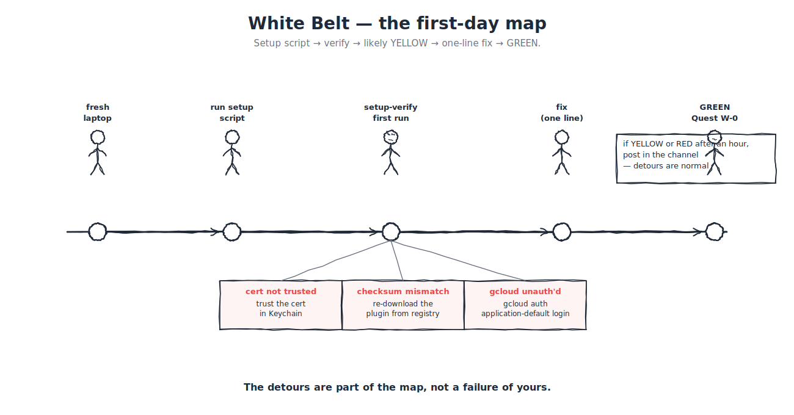

# Quest W-0 - Turn GREEN

> **Win condition:** setup verification shows all required White Belt checks GREEN, and the evidence is captured in a form a reviewer can inspect.

Quest W-0 is the gate. It happens before the sandbox PR because a broken environment makes every later failure ambiguous.



The detours on the map (cert not trusted, plugin checksum mismatch, gcloud unauthenticated) are the *common* shapes — landing on one is normal, not a failure. The one-line fix is named beside each.

---

## Prerequisite

Complete or skim:

- [W.4 Your auth setup](W04-auth-setup.md) — MyAccess + manager approval.
- [W.5 Installing the stack](W05-installing-the-stack.md) — the canonical setup script. **Do W.5 first; this quest verifies what W.5 set up.**
- [W.7 Compass plugin](W07-compass-plugin.md)
- [W.8 GREEN / YELLOW / RED](W08-green-yellow-red.md)

No separate verification tool — the verification is running through the five-step sequence below.

---

## The task

Run the five verification steps in order and capture the output. If any step fails, run the one-line fix and re-run. If a fix does not unblock you, route to [`#claude-onboarding-support`](https://razorpay.slack.com/archives/C0ANCMTCJA2) with what you tried.

### Step 1 — Setup script completed

You ran this in W.5:

```bash
curl -fsSL https://get-claude.dev.razorpay.in/setup.sh | bash
```

GREEN if the script printed a "Setup complete" line at the end. YELLOW if it printed warnings but completed. RED if it errored mid-way and stopped.

*One-line fix for YELLOW:* re-run the same command. The script is idempotent.

### Step 2 — Terminal restarted

Close the terminal window where you ran the setup script. Open a new one. Environment variables only apply to new shells; this step is small but mandatory.

### Step 3 — Claude Code on PATH

```bash
claude --version
```

GREEN if it prints a version string (e.g. `claude 1.2.3`). RED if you see `command not found`.

*One-line fix for RED:* re-run the setup script, restart terminal, retry.

### Step 4 — Agent mode opens

```bash
claude
```

GREEN if the agent prompt opens cleanly. YELLOW if it asks you to `/login` — follow the SSO flow in the browser, then you should be in. RED if it errors with `403 PERMISSION_DENIED` referencing `aiplatform.googleapis.com` — that is stale Vertex env vars from before the LiteLLM migration (see W.5 Common failure modes #3).

### Step 5 — A prompt round-trips

Inside the `claude` prompt, type:

```
hello
```

GREEN if you get a reply. Exit with `Ctrl-D` or `/exit`.

YELLOW if it replies but the usage does not appear in the LiteLLM dashboard — your shell env vars are overriding `~/.claude/settings.json` (see W.5 Common failure modes #7).

RED if it errors with `401 authentication_error` — LiteLLM key needs refreshing; re-run the setup script.

---

**You are GREEN for Quest W-0 when all five steps pass on the same fresh terminal session.**

---

## Evidence template

Copy this into your tracker note or badge draft:

```markdown
## Quest W-0 evidence

Builder handle:
Date:
Machine class:
Setup route:
Plugin version:
Verification result: GREEN / YELLOW / RED
Screenshot or log link:
Reviewer: self-attested / reviewer handle
Follow-up needed:
```

For W-0, self-attestation is acceptable if the cohort rules allow it. The screenshot or log must still exist.

---

## What counts

This counts:

- all required checks GREEN;
- screenshot or redacted log attached;
- plugin version visible or recorded;
- date recorded;
- any repair notes captured if the first run was not GREEN.

This does not count:

- "It worked on my machine" with no evidence;
- nine GREEN checks and one YELLOW;
- a screenshot that hides which checks ran;
- a verification run from a different machine;
- a teammate's output reused as yours.

---

## Triage routing

If you are YELLOW after one focused repair attempt:

```text
Quest: W-0 Turn GREEN
Colour: YELLOW
Failing check:
Command run:
Redacted output:
What I tried:
```

If you are RED, skip the extra attempts and route immediately. RED is a stop sign.

---

## Success criteria

You pass Quest W-0 when:

- verification result is GREEN;
- evidence template is filled;
- screenshot or redacted log exists;
- plugin version is recorded;
- no private material is included in the evidence.

---

## What you can say after this quest

> "My machine is GREEN for White Belt work."

That is the unlock for Quest W-1.

> **Pin this for the rest of the week.** [H.7 — Day-1 quick reference](../../appendices/H-reference-cards/H7-day-1-quick-reference.md) is the single-page card with every command, channel, and contact you'll need over your first week. Bookmark it now so you don't search later.

---

**Previous:** [W.12 Your first PR](W12-first-pr.md) - **Next:** [Quest W-1 HelloRazorpay commit](quest-W1-hello-razorpay.md)

