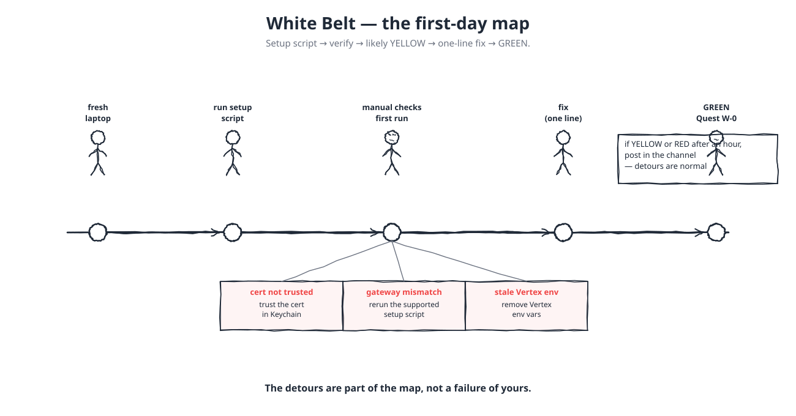

# Quest W-0 - Turn GREEN

> **Win condition:** all seven checks in the supported White Belt setup gate are GREEN, and the evidence is captured in a form a reviewer can inspect.

Quest W-0 happens before the sandbox PR because a broken environment makes every later failure ambiguous.



The detours on the map—certificate trust, gateway configuration, stale Vertex variables—are common. Landing on one is normal; hiding it is not.

---

## Prerequisite

Complete or skim:

- [W.4 Your auth setup](W04-auth-setup.md) — MyAccess + manager approval.
- [W.5 Installing the stack](W05-installing-the-stack.md) — the canonical setup script. **Do W.5 first; this quest verifies what W.5 set up.**
- [W.7 Compass plugin](W07-compass-plugin.md) — how to distinguish source from commands available in your session.
- [W.8 GREEN / YELLOW / RED](W08-green-yellow-red.md) — the evidence contract and colour rules.

The playbook keeps a ten-check `setup-verify` reference definition under [`skills/`](../../skills/setup-verify/README.md), but that repository directory is not proof of an installed command. This quest uses the direct checks every learner can run.

---

## The task

Run the seven-check manual gate, resolve every YELLOW or RED, and capture the final GREEN table.

### Step 1 — Start from a fresh terminal

Close the terminal where you ran W.5 and open a new one. Run the copyable block under [W.5 — What setup verification should prove](W05-installing-the-stack.md#what-setup-verification-should-prove).

The checks cover Git, Node, pnpm, Claude Code, the LiteLLM gateway setting, retired Vertex variables, and a live prompt round-trip.

### Step 2 — Record each result

Copy the table from [W.8](W08-green-yellow-red.md#worked-example) into your tracker note. Paste only the minimum redacted evidence needed to prove each row. Never paste a LiteLLM key, custom-header value, token, or unrelated environment output.

### Step 3 — Fix, rerun, then capture GREEN

For each non-GREEN row:

1. use the matching fix in [W.5](W05-installing-the-stack.md#common-failure-modes) or [Appendix D](../../appendices/D-known-issues/README.md);
2. rerun the failed command after the repair and terminal restart, if required;
3. refresh the complete seven-row table.

If any RED persists after one focused repair, post the redacted failed command and output in [`#ai-help`](https://razorpay.slack.com/archives/C08C35GKJKD) with the fix you tried.

### If a check cannot start

Use the symptom to reach the right fix:

- `zsh: command not found: claude` → follow [D.8](../../appendices/D-known-issues/README.md#d8--command-not-found-claude-after-install-status-fixed), restart the terminal, and retry.
- An in-session `/login` prompt → follow that SSO flow. Do not run `claude /login` from the shell; see [D.11](../../appendices/D-known-issues/README.md#d11--unknown-skill-login-after-running-claude-login-status-fixed) if you already saw `Unknown skill: login`.
- `403 PERMISSION_DENIED` mentioning `aiplatform.googleapis.com` → remove stale Vertex variables via [D.3](../../appendices/D-known-issues/README.md#d3--403-permission_denied-referencing-aiplatformgoogleapiscom-status-fixed), restart the terminal, and retry.
- A plugin command is missing after Claude opens → use `/help`, then follow [W.7](W07-compass-plugin.md). Do not block W-0 on a reference-only command.

**You are GREEN for Quest W-0 only when all seven manual checks show GREEN on your machine.**

---

## Evidence template

Copy this into your tracker note or badge draft:

```markdown
## Quest W-0 evidence

Builder handle:
Date:
Machine class:
Setup route:

| Check | Evidence | Colour |
|---|---|---|
| Git | | |
| Node | | |
| pnpm | | |
| Claude Code | | |
| LiteLLM configuration | | |
| Retired Vertex configuration | | |
| Prompt round-trip | | |

Overall: GREEN / YELLOW / RED
Screenshot or log link:
Reviewer: self-attested / reviewer handle
Repair note, if any:
```

For W-0, self-attestation is acceptable if the cohort rules allow it. The screenshot or log must still exist.

---

## What counts

This counts:

- all seven checks GREEN;
- a screenshot or redacted log attached;
- date and machine class recorded;
- repair notes captured if the first run was not GREEN.

This does not count:

- "It worked on my machine" with no evidence;
- six GREEN checks and one YELLOW;
- a screenshot that hides which checks ran;
- a report from a different machine;
- waiting for an undistributed reference command instead of running the manual gate.

---

## Triage routing

If you are YELLOW after one focused repair attempt:

```text
Quest: W-0 Turn GREEN
Colour: YELLOW
Failing check:
Command run:
Redacted output:
What I tried:
```

If you are RED, skip extra experiments and route immediately. RED is a stop sign.

---

## Success criteria

You pass Quest W-0 when:

- the seven-row result is GREEN;
- the evidence template is filled;
- a screenshot or redacted log exists;
- no private material is included.

---

## What you can say after this quest

> "My machine is GREEN for White Belt work."

That is the unlock for Quest W-1.

> **Pin this for the rest of the week.** [H.7 — Day-1 quick reference](../../appendices/H-reference-cards/H7-day-1-quick-reference.md) is the single-page card with the setup gate, channels, and common failure modes.

---

**Previous:** [W.12 Your first PR](W12-first-pr.md) - **Next:** [Quest W-1 HelloRazorpay commit](quest-W1-hello-razorpay.md)
