# G.1 — The Three Pillars

The single most useful frame for getting better at AI-assisted coding is Simon Willison's three-pillar decomposition: every AI session you run rests on three independent legs (**prompt**, **context**, **harness**) and the quality of the session is bounded by the weakest leg. This module is the voice anchor for Green Belt. Read it first; the rest of Part A applies it.

---

## If you're short on time

- A bad output usually has one fixable cause: bad prompt, missing context, or a wrong-tool harness. Naming the pillar shortens the fix from minutes to seconds.
- Investing in any one pillar pays compound returns; investing in all three is what separates Green Belt from Yellow.
- "Make it better" is a prompt problem. "Why did it not see file X" is a context problem. "Why did it not run the tests" is a harness problem.

---

## The mental model

Three legs, every session:



<details>
<summary>Text version (for Markdown viewers that don't render SVG)</summary>

```
   ┌───────────────────────────────────────────┐
   │              YOUR AI SESSION              │
   └───────────────────────────────────────────┘
              │             │             │
              ▼             ▼             ▼
        ┌──────────┐  ┌──────────┐  ┌──────────┐
        │  PROMPT  │  │ CONTEXT  │  │ HARNESS  │
        │ what you │  │ what it  │  │ what it  │
        │   ask    │  │   sees   │  │  can do  │
        └──────────┘  └──────────┘  └──────────┘
```

</details>

**Prompt** is the words you type: your goal, your constraints, your success criteria, the level of detail. Yellow Belt's Y.3 (Prompt quality, deep dive) is the canonical reference.

**Context** is what the agent can read while answering: your files, your repo, your CLAUDE.md, your connectors, your prior conversation. Yellow Belt's Y.4 and Y.5 covered the basics; Green Belt's G.2–G.5 covers the depth.

**Harness** is the tooling around the agent — Claude Code vs Claude.ai, which MCPs are loaded, which skills are available, whether the agent can run a command or just propose one. Yellow Belt's Y.7 introduced permissions and hooks; Green Belt's G.8–G.10 builds the harness deeper.

The three pillars are *independent*. A perfect prompt against an empty context window will fail. A repo full of context but a vague prompt will produce vague output. Two perfect pillars and a bad harness (running Claude.ai on a repo question) will collapse the session entirely.

---

## Why this matters

Two minutes of practice with the three-pillar frame change how you debug AI sessions forever. The next time an output disappoints you, ask which pillar is weak rather than which knob to turn.

A session that produces wrong code is rarely "the AI is bad." It is almost always one of:

- the prompt did not name the constraint that produced the bad code (prompt);
- the agent never saw the file or rule that would have prevented the bad code (context);
- the agent could not run the test that would have caught the bad code (harness).

A Green Belt builder names the pillar in five seconds. A Yellow Belt builder retries with a different phrasing. The five seconds is the upgrade.

---

## Worked example

You ask Claude Code to add a button to a dashboard. The output uses a custom `<div>` with inline styles instead of the design-system `Button` component. The session feels broken. Diagnose by pillar:

**Prompt check.** Did you name the constraint "use the design-system Button component"? If not, the prompt is the weak leg. The fix is to say it explicitly next time, or to commit it once into a skill or a CLAUDE.md so you do not have to say it.

**Context check.** Was the design-system connector loaded? Was the agent allowed to read the components folder? Did the CLAUDE.md mention the design system as a hard rule? If any answer is no, context is the weak leg.

**Harness check.** Were you running Claude.ai instead of Claude Code? Was the program-pinned plugin out of date and missing the design-system skill? If yes, harness is the weak leg.

Most disappointing sessions you walk through this way reveal one weak pillar, sometimes two. Almost never all three. The weak pillar is the fix.

---

## A working glossary

This module fixes some vocabulary the rest of Part A will use.

- **Prompt engineering.** The craft of writing requests. Trade space: clarity, scope, constraints, success criteria, tone.
- **Context engineering.** The craft of curating what the agent reads. Trade space: file selection, CLAUDE.md design, connector choice, history.
- **Harness engineering.** The craft of choosing and shaping the runtime. Trade space: which surface (Code, Cowork, Cursor), which skills, which MCPs, which permissions, which hooks.
- **Three-pillar diagnosis.** The two-minute habit of asking "which leg is weak" before retrying.
- **Compounding.** The property of context and harness investments where the same investment pays off across many sessions. Prompt investments pay off once.

---

## Common failure modes

**Confusing prompt with context.** A learner blames "the prompt" for an output that was actually missing a file the agent never saw. Fix: ask the agent "what did you read before answering?" If the answer omits the file you assumed it read, context is the weak pillar.

**Confusing context with harness.** A learner blames "the AI" for not running the test, when the harness did not allow command execution. Fix: ask the agent "can you run this test?" If the answer is no, the harness is the weak pillar.

**Treating a strong prompt as a substitute for a CLAUDE.md.** Prompts are per-session; CLAUDE.md is per-repo. Saying "always use the design-system Button" five times a day is the wrong layer; commit it once.

**Investing all in prompts.** Yellow Belt taught prompt craft; Green Belt is supposed to teach context and harness. Builders who stay in prompt-only mode plateau.

**Treating harness changes as last resort.** Sometimes the right move is "run this in a worktree with a fresh agent and the production-compiler skill loaded," not "ask the same question with more words."

---

## GREEN / YELLOW / RED self-check

- 🟢 GREEN — I can name which pillar is weak in any disappointing session within thirty seconds.
- 🟡 YELLOW — I understand the three pillars but still default to "rewrite the prompt" when something fails.
- 🔴 RED — I think prompts are the only lever I have.

If RED, re-read Y.3 (Prompt quality, deep dive) and come back. If YELLOW, the rest of Part A is your fix; the eight chapters after this one are about the context and harness pillars.

---

## What you can say after this module

> "I can diagnose any AI session by naming the weak pillar and fix that pillar specifically."

---

## Where to go next

The next module is G.2 — *Why context windows fill*. It is the constraint chapter that anchors everything we do with CLAUDE.md and skills.

**Previous:** [← Part A README](README.md) · **Next:** [→ G.2 Context windows](G02-context-windows.md)

**Further reading**

- [Simon Willison on the three pillars](https://simonwillison.net/2025/Oct/15/designing-agentic-loops/)
- [Yellow Belt Y.3 — Prompt quality, deep dive](../../02-yellow/Y03-prompt-quality-deep.md)
- [Appendix N.5 — Three pillars (deeper treatment)](../../../appendices/N-methodologies/N5-three-pillars.md)
