# G.15 — Design-to-code

This is the longest single module in Part B and arguably in the playbook so far. A Green Belt builder who can take a Figma frame and produce running code that respects the design system, the codebase conventions, and the team's tone is the most leveraged builder on a frontend team. The path runs through three pieces of infrastructure: the Figma connector (an MCP that reads design surfaces), Blade (Razorpay's design system), and Code Connect (Figma's mapping layer between components and code).

This chapter walks the path end to end with a real worked example.

---

## If you're short on time

- Design-to-code is not "ask Claude to make a button look like the Figma." It is "Claude reads the Figma surface via the connector, identifies the closest Blade components, names the gaps, and writes code that uses real Blade primitives."
- Before generation, lock the frontend/backend contract with the repository owner: authority, request and response shapes, permissions, UI states, and fixtures. Do not let the agent invent the seam.
- The flow has five named steps. Skipping any one of them produces ad-hoc components that drift from the design system.
- The boss fight in Part C requires a product-repo PR built through this flow, with Code Connect mappings and Blade-native components — not a pixel-pushed lookalike.
- When the change affects a real journey, run a DQA flow review on the preview before PR. Treat the report as review evidence and a fix list, not as permission to skip human design review.

---

## The mental model

The pipeline below starts after the interface contract in Gate 0 is GREEN.



<details>
<summary>Text version (for Markdown viewers that don't render SVG)</summary>

```
   ┌───────────────────────────────────────────────┐
   │              DESIGN-TO-CODE FLOW               │
   ├───────────────────────────────────────────────┤
   │                                                 │
   │  1. Figma frame  ─────────────────────┐        │
   │                                         ▼        │
   │  2. Figma connector reads the frame   →  agent │
   │                                                 │
   │  3. Agent matches frame elements to    │       │
   │     Blade components (via Blade docs   │       │
   │     and Code Connect mappings)         │       │
   │                                                 │
   │  4. Agent names gaps: components that   │      │
   │     do not exist or that the design     │      │
   │     uses non-canonically                │      │
   │                                                 │
   │  5. Agent generates code using Blade    │      │
   │     primitives, tokens, and variants    │      │
   │                                                 │
   └───────────────────────────────────────────────┘
```

</details>

The key property: the agent never invents a component. It maps Figma → Blade. When the design uses something Blade does not have, the agent surfaces the gap; it does not paper over it with a custom `<div>`.

---

## The three infrastructure pieces

### Figma connector

An MCP that lets the agent read a Figma frame, its layers, and its component instances. Public docs: [`figma.com/developers`](https://www.figma.com/developers/api). Razorpay's program-pinned plugin includes the Figma connector by default; Yellow Belt's [Y.9 Figma MCP](../../02-yellow/Y09-figma-mcp.md) introduced its mechanics.

What it gives the agent: text content, layout structure, used component names, color tokens, type tokens, spacing values. Not pixel-perfect screenshot fidelity; structural fidelity.

### Blade

Razorpay's open-source design system. Published components, primitives, variants, accessibility behaviour. The agent has access to Blade's docs via the design-system connector and to Blade's code via the package import in your repo. Tokens live in Blade; primitives live in Blade; the team should never define their own.

G.16 is the deep dive. For this chapter: trust that Blade has a `Button`, an `Input`, a `Modal`, a `Tabs`, a `Card`, and so on; trust that each has variants the agent can pick from.

### Code Connect

Figma's mapping layer. A line in a `code-connect` config tells Figma "this Figma component named *Primary CTA* corresponds to the Blade `Button` with `variant='primary'`." The agent reads the mapping, picks the right component, and writes code that uses it.

When mappings exist, design-to-code is mechanical. When they do not, the agent has to guess — and guessing is where drift happens. Adding a mapping for a frequently-used component is a high-leverage Code Connect contribution.

---

## Gate 0 — lock the interface contract

Figma defines what the user sees. The backend contract defines what the frontend can ask for and what it can receive. Lock that seam before the five-step flow starts. Otherwise an agent can generate a convincing UI against fields, errors, or permissions that the service does not support — fast work that turns into slow rework.

For a product UI change, this gate can be a short card rather than a new design document. Fill it with the PM or designer, the backend or repository owner, and the authoritative API artefact. That artefact might be an approved API design, an OpenAPI description, a typed interface already in the repo, or an agreed mock. The card points to the source of truth; it does not replace it.

### Copyable contract-readiness card

```text
Feature / journey:
Frontend owner:
Backend or repository owner:
Authoritative contract: <approved spec, OpenAPI, typed interface, or mock link>

Operation:
- endpoint or tool + method:
- auth and permission rule:
- request fields:
- success response fields:

UI states backed by the contract:
- loading:
- success:
- empty:
- validation error:
- service error + retry:
- unauthorised / forbidden:

Fixtures:
- one named example for every state above:

Change rule:
- who approves a contract change:
- how the frontend owner is notified:
```

The gate is GREEN when every field has an answer, every designed state has a fixture, and the backend or repository owner has confirmed the named source of truth. `TBD` is not a contract. If the backend is still moving, prototype against clearly labelled fixtures, but do not treat generated code as production-ready.

Use the agent to find mismatches, not to settle them:

```text
Read <contract-link>, <Figma-link>, and the relevant frontend code.
Fill the contract-readiness card above.
For every interactive control and designed state, cite the contract field,
response, permission, or fixture that supports it.
Do not infer missing endpoints or fields. Stop and list unresolved gaps.
Generate no production code until I confirm the backend or repository owner approved the card.
```

This is deliberately a small, copyable checkpoint: fill it, resolve the gaps, then continue.

---

## The five-step flow

Start these steps only after Gate 0 is GREEN.

### Step 1 — Read the Figma frame via the connector

Tell the agent which frame. Either paste the Figma link or invoke a slash command that reads the current selection.

> "Read the Figma frame at <link>. Tell me what components it uses, what layout it has, and what tokens it references. Do not generate code yet."

The agent reads the frame. It returns a structured list:

- "Six instances of the *Primary CTA* component."
- "One instance of the *Card with action footer*."
- "Three text styles: heading-2, body, caption."
- "Spacing values: 16, 24, 32 (matches Blade's spacing scale)."

This is the starting context. Without it, every subsequent step is guesswork.

### Step 2 — Match Figma components to Blade primitives

The agent uses Code Connect mappings (where they exist) plus Blade's docs to translate.

> "Map the components the frame uses to Blade primitives. For each: name the Blade component, the variant, and the props it expects. If a Figma component has no Code Connect mapping, surface it as a gap."

The agent returns a mapping table:

| Figma component | Code Connect | Blade primitive | Variant / props |
|---|---|---|---|
| Primary CTA | yes | `Button` | `variant='primary'`, `size='medium'` |
| Card with action footer | yes | `Card` | with `Card.Footer` slot |
| Section heading | no — gap | `Heading` (closest match) | `level={2}` |

The "no — gap" row is the most important output of this step. Without naming the gap, the agent will silently use the closest match, which is sometimes right and sometimes a quiet drift.

### Step 3 — Name the gaps

For each gap, the agent surfaces the trade-off:

- "The Figma uses *Section heading* with a custom underline; Blade's `Heading` does not have that variant. Two options: (a) use Blade's `Heading` and accept that the underline is missing, file a Blade contribution; (b) wrap Blade's `Heading` with a one-off underline div for now and flag the wrap for a follow-up."

The team's CLAUDE.md should name the policy here. Most Razorpay teams pick (a) and file a Blade contribution; some accept (b) for non-critical surfaces with a tracked follow-up. The skill is *not* to invent option (c) — a custom heading component that drifts forever.

### Step 4 — Generate code using Blade primitives

Now and only now, the agent writes code.

> "Generate the React component for this frame. Use the Blade primitives from step 2's mapping table. For the gap from step 3, use option (a): use Blade's `Heading` and file a Blade contribution issue."

The output is a React component file. Every `<Button>` is a Blade `Button`. Every spacing value is a Blade token. Every text style is a Blade `Text` or `Heading` with the right variant. The only custom code is the *layout* (which is a flex or grid arrangement of Blade primitives), not the components themselves.

### Step 5 — Run the daily loop on the result

The component renders in your local dev (G.18), you preview it on a branch URL (G.19), the design partner reviews. Iterate. The iteration is structural — a wrong variant gets fixed by changing the variant prop, not by adding CSS.

### DQA review — when the change is a journey, not a component

After the component renders in preview, ask Design Quality Agent (DQA) to review the journey if the change affects a customer-visible flow, mobile + desktop behaviour, accessibility, or a persona-specific decision. This is review evidence, not generation. The code is already in a branch; DQA is now helping you find the UX holes before a human reviewer has to.

Use a bounded prompt:

```text
Do a design review of <preview-url>.
Goal: <user goal, e.g. create a Payment Link>.
Cover: desktop and mobile if available.
Pause and hand control back to me on login, OTP, payment, or other sensitive steps.
Return: top 3 fixes, UI/UX score, screens covered, and any persona-specific risk.
```

What to do with the output:

1. Fix the top issues that are in scope for this PR.
2. Paste the top 3 findings and the HTML-report link or saved artefact into the PR notes.
3. If DQA flags a design-system gap, route it like any other Blade / Code Connect gap instead of hiding it with custom CSS.
4. If the report disagrees with your design partner, the human wins; capture the disagreement as a note, not a fight with the bot. The bot does not get a feelings budget.

DQA is especially useful on full flows because it returns a combined UI + UX report with per-screen coverage and persona impact. It is less useful for a one-line copy fix; do not make a tiny PR wear a tuxedo.

---

## A worked example, end to end

A real run, condensed:

> **Builder (Gate 0).** Links the approved cart API contract; records the read operation, auth rule, success and error responses, and empty/error fixtures; gets the repository owner's confirmation. No contract gaps remain.
>
> **Builder.** "Read the Figma frame at <link>. Map components to Blade. Name gaps. Generate the React file. Use the team's conventions in `CLAUDE.md`."
>
> **Agent (after step 1).** "Frame is the empty-state view of the cart screen. Components: 1 illustration (custom, no Blade equivalent), 1 heading, 1 paragraph, 1 primary CTA, 1 secondary link. Spacing 16/24/40 — all Blade tokens."
>
> **Agent (after step 2).** "Mapping table: heading → `Heading level={2}`. Paragraph → `Text variant='body'`. Primary CTA → `Button variant='primary' size='medium'`. Secondary link → `Link variant='subtle'`. Illustration → no Code Connect mapping; team CLAUDE.md says illustrations live in `assets/illustrations/` as SVG."
>
> **Agent (after step 3).** "One gap: the illustration. Following CLAUDE.md, I will reference `assets/illustrations/cart-empty.svg` if it exists; if it does not, I will leave a placeholder `` and flag in the PR that the SVG needs to land first."
>
> **Agent (after step 4).** Produces `src/views/cart/EmptyState.tsx`. Twenty lines. Every primitive is Blade. Every spacing value is a Blade token. The illustration uses the placeholder pattern.
>
> **Builder.** Runs the daily loop (G.18), previews on a branch URL (G.19), iterates with the design partner. Two rounds; the cart-empty SVG lands; ship.

Total time, end to end: under an hour. Without the flow, the same task takes a day of "ask Claude, paste output, fight over the design-system mismatch, redo."

---

## Why this works only with all three pieces

Drop any of the three and the flow falls apart:

- **No Figma connector.** The agent is guessing what the design says. Output is a vibe.
- **No Blade.** The agent is generating ad-hoc components. Drift compounds.
- **No Code Connect mappings.** The agent is guessing the right Blade primitive for each Figma component. Sometimes right; sometimes drift.

The combination is what makes design-to-code mechanical. A Razorpay program that wants frontend velocity invests in all three.

---

## Common failure modes

**Skipping step 1.** Going straight to "generate the code from this Figma." The agent guesses the structure; output is shaky. Fix: always read first.

**Generating against an unlocked backend contract.** The UI looks complete, but fields, permissions, or failure states were guessed. Fix: complete Gate 0 with the backend or repository owner, and require a fixture for every designed state before production generation.

**Skipping step 3.** The agent finds a gap and silently picks the closest match. Sometimes right; often a quiet drift. Fix: always make the agent name gaps explicitly.

**Pixel-pushing the result.** The component renders, but it does not match the Figma exactly, so the builder asks Claude to add CSS to fix the gap. Now the component is a Blade primitive plus custom CSS, which is the worst of both worlds. Fix: if the result does not match, the *Code Connect mapping* or the *Blade variant* is wrong; fix one of those.

**Ignoring Code Connect.** The agent has to re-derive the Figma → Blade mapping every session. Fix: add Code Connect mappings for the components your team uses most. The skill is to *contribute mappings*, not to work around their absence.

**Custom heading / button / card / modal components.** The single most expensive drift. Fix: refuse the temptation. Use Blade or contribute to Blade.

**Not running the daily loop.** Generated code that has not been seen in a real browser is hypothetical code. Fix: always preview on a branch URL.

---

## GREEN / YELLOW / RED self-check

- 🟢 GREEN: I can lock the interface contract, take a Figma frame through the five steps, name gaps, and produce running code that uses Blade primitives end-to-end without fighting the design system.
- 🟡 YELLOW — I can run the flow, but the contract card still has an unconfirmed owner, state, or fixture, or I tend to skip gap-naming and end up with ad-hoc components.
- 🔴 RED — I have not locked an interface contract or completed a design-to-code session through the connector + Blade + Code Connect path.

---

## What you can say after this module

> "I lock the frontend/backend contract, then take Figma frames through the Figma connector, Blade, and Code Connect into running code — without inventing either the interface or the components."

---

## Where to go next

G.16 (*Blade deep dive*) is the reference chapter for Blade itself. After this chapter, you know the *flow*; the next chapter gives you Blade's *anatomy*.

**Previous:** [← G.14 seed.spec.ts](G14-tests-seed-spec.md) · **Next:** [→ G.16 Blade deep dive](G16-blade-deep-dive.md)

**Further reading**

- [Yellow Belt Y.9 — Figma MCP for non-engineers](../../02-yellow/Y09-figma-mcp.md)
- [Foundation 0A.5 — What is an API? What is a UI?](../../../foundation/tech-101/05-api-vs-ui.md)
- [OpenAPI Specification](https://spec.openapis.org/oas/latest.html) — a machine-readable way to describe an HTTP API contract
- [Blade design system docs](https://blade.razorpay.com/)
- [Figma Code Connect docs](https://www.figma.com/code-connect-docs/)
- [Appendix C — Skills Library](../../../appendices/C-skills-library/README.md)
