# G.26 — The pre-ship-check skill

The canonical Razorpay-shipped skill that runs before every PR. Six layers of structured review that catch the most common drift before reviewer time gets spent on it. The Boss Fight in Part C explicitly requires a clean pre-ship-check pass; this chapter teaches what each layer checks and how to read the report.

The skill is described at the contract level (matches G.13 / G.17 treatment): what it triggers on, what it does, what it refuses, what it produces. The skill's internal implementation is downstream of this chapter.

---

## If you're short on time

- Pre-ship-check is a six-layer gate: redlines, design system, tests, PR craft, prompt-craft trace, and behaviour preservation.
- A clean pass means all six layers green. A flagged layer surfaces the specific issue with line references; you fix and re-run.
- The skill never auto-fixes. It surfaces; you decide. The boss fight requires a clean pass at PR time.

> **Where this lives.** The skill is at [`skills/pre-ship-check/`](../../../skills/pre-ship-check/). The chapter describes the policy; the skill applies it. Both are the contract.

---

## The mental model



<details>
<summary>Text version (for Markdown viewers that don't render SVG)</summary>

```
   ┌────────────────────────────────────────────────┐
   │       PRE-SHIP-CHECK — six layers                │
   ├────────────────────────────────────────────────┤
   │                                                  │
   │   1. Redlines                                    │
   │      Scans diff for the four redline categories │
   │      from G.22; flags any that survived.        │
   │                                                  │
   │   2. Design system                               │
   │      Checks UI changes use Blade primitives,    │
   │      tokens, variants. Flags ad-hoc components. │
   │                                                  │
   │   3. Tests                                       │
   │      Confirms test coverage exists for changed  │
   │      behaviour; flags missing or weak tests.    │
   │                                                  │
   │   4. PR craft                                    │
   │      Title shape, description quality, ticket   │
   │      reference, screenshot or preview link.     │
   │                                                  │
   │   5. Prompt-craft trace                          │
   │      Was the change built through the           │
   │      program-pinned plugin? Does the session    │
   │      log show three-pillar discipline?          │
   │                                                  │
   │   6. Behaviour preservation                      │
   │      Confirms the diff does not silently change │
   │      behaviour the PR description does not name.│
   │                                                  │
   └────────────────────────────────────────────────┘
```

</details>

A passing PR has all six layers green. The boss fight requires a clean run; v0.11 cohort calibration uses the report shape consistently across teams.

---

## The contract

**Trigger phrases.** "Run pre-ship-check on this branch", "check before review", "is this ready to ship", "/pre-ship-check" (the slash command).

**Bounded job.** Inspect the diff against the base branch through six layers; produce a structured report with one section per layer; mark each layer GREEN / YELLOW / RED with a one-paragraph rationale per non-GREEN finding.

**Inputs.** The current branch, the base branch, the team's CLAUDE.md, the Blade design-system connector, the Playwright test directory if one exists, the program's redline list (Appendix H), and the prompt-craft session log if available.

**Outputs.** A six-section report: one section per layer, each with a colour and a list of findings. Findings reference file paths and line numbers where applicable. The report ends with a summary line ("All six layers GREEN (ready for review" or "X layers flagged) see findings").

**Hard rules.** Never auto-fix. Never weaken a layer's standard to make a PR pass. Never silently rewrite a PR description without showing the diff. Never bypass a layer because of time pressure.

---

## The six layers, explained

### Layer 1 — Redlines

Scans the diff for the four redline categories from G.22:

- credentials (`Bearer ...`, token-shaped strings near key/auth/password contexts);
- money-handling identifiers (live transaction IDs, payment instrument data);
- raw customer PII;
- regulator-protected fields (PCI, RBI scope).

**GREEN** means the scan completed with zero flags. **YELLOW** means the scan flagged something the builder should review (a value that *looks* like a token but might be a placeholder; a string that *might* be PII but might be synthetic). **RED** means the scan flagged something that almost certainly should not ship (a real-shaped credential; a real customer email; a card-shaped string).

The layer defers to Appendix H for the canonical redline cards.

### Layer 2 — Design system

For UI changes, checks that the diff uses Blade primitives, tokens, and variants per G.16:

- ad-hoc `<div>` styled like Blade components → flagged;
- raw colour or spacing values that have token equivalents → flagged;
- custom Button / Input / Modal-shaped components → flagged unless explicitly justified;
- accessibility properties on interactive elements → checked.

**GREEN** means UI changes use Blade end-to-end. **YELLOW** means small drift (one raw value where a token exists, one ad-hoc layout pattern) — fixable in minutes. **RED** means a custom Button-shaped component, a Modal reinvented, or accessibility behaviour stripped.

The layer cross-references G.17's production-compiler skill: a flagged Layer 2 sometimes routes to a production-compiler invocation as the fix.

### Layer 3 — Tests

Looks at the changed code and asks: does test coverage exist for the changed behaviour?

- new behaviour shipped without a test → flagged;
- new UI without a Playwright test for the changed visual behaviour → flagged;
- weakened assertions (a test that used to be `expect(x).toBe(true)` now `expect(x).toBeTruthy()`) → flagged;
- snapshot tests that absorbed unexpected changes → flagged.

The layer cross-references G.12 / G.13 / G.14 for testing discipline.

### Layer 4 — PR craft

Inspects the PR description and metadata:

- title that names the change at the right altitude (not "fix bug", not "complete refactor of auth, billing, and analytics in one PR");
- description that names what + why + how to verify;
- ticket reference if applicable;
- preview URL (per G.19) if the change is UI-shaped;
- a brief test plan that names what the reviewer should check.

The layer mirrors the PR-craft chapter (Y.13) and the team's PR-craft skill if one is loaded.

### Layer 5 — Prompt-craft trace

The Green-Belt-distinct layer. Looks at the session log (when available via the program-pinned plugin) and asks:

- was the change built using the program-approved tooling (Claude Code through the proxy);
- does the session show three-pillar discipline (G.1): clear prompt, sufficient context, appropriate harness;
- did the builder push back when the agent was confidently wrong (G.21);
- did the design-system connector get used for UI work, the production-compiler for inherited drift, etc.

This layer is harder to automate fully; the skill summarises what is verifiable and flags ambiguity for the reviewer's attention. The boss fight teammate sign-off explicitly references this layer.

### Layer 6 — Behaviour preservation

Cross-checks the diff against the PR description: does the diff change behaviours the description does not name? A "small fix" PR that silently refactors three other modules is flagged regardless of the refactor's quality.

The layer is the program's defence against scope-creep PRs that lose reviewer signal.

---

## Reading the report

A typical run on a healthy PR:

```
Pre-ship-check report

Branch: feat/cart-empty-state
Base: main

Layer 1 (Redlines):       GREEN  — clean
Layer 2 (Design system):  GREEN  — uses Blade Button, Stack, Heading
Layer 3 (Tests):          GREEN  — Playwright test added at tests/e2e/cart-empty.spec.ts
Layer 4 (PR craft):       GREEN  — title, description, preview URL all present
Layer 5 (Prompt craft):   GREEN  — three-pillar discipline visible in session log
Layer 6 (Behaviour):      GREEN  — diff matches description scope

All six layers GREEN — ready for review.
```

A typical run on a PR with drift:

```
Pre-ship-check report

Branch: fix/dashboard-legend
Base: main

Layer 1 (Redlines):       GREEN  — clean
Layer 2 (Design system):  YELLOW — apps/dashboard/Legend.tsx line 47:
                                    raw colour value '#0066ff'; use
                                    colors.surface.action.primary token.
Layer 3 (Tests):          RED    — no Playwright test added for changed
                                    layout behaviour at small viewports.
                                    See G.12 for the spec-then-code loop.
Layer 4 (PR craft):       GREEN  — title, description, preview URL all present
Layer 5 (Prompt craft):   GREEN  — three-pillar discipline visible
Layer 6 (Behaviour):      GREEN  — diff matches description scope

2 layers flagged: 1 YELLOW (small fix), 1 RED (must address).
```

The builder reads the flags, fixes Layer 2 (token swap, two minutes) and Layer 3 (write the spec-then-code Playwright test, fifteen minutes), re-runs, and ships when all six are GREEN.

---

## What this chapter is not

**Not the policy.** The skill *applies* policy from G.22 (redlines), G.16 (design system), G.12-G.14 (tests), Y.13 (PR craft), G.1 (three pillars), and the program's behaviour-preservation expectations. If the policies change, the skill is updated.

**Not a substitute for human review.** The pre-ship-check is the *pre-* in pre-ship-check. The reviewer comes after. A clean pre-ship-check makes the reviewer's job possible; it does not replace the reviewer.

**Not optional.** The boss fight in Part C requires a clean pass. The program's PR-merge convention treats a flagged pre-ship-check as a blocker.

---

## Common failure modes

**Skipping the skill on "small" PRs.** "It's just a one-line fix" is the highest false-confidence pattern. The redline scan still applies. Fix: run on every PR.

**Working around a flag.** Removing test coverage to escape a Layer 3 flag is the failure mode the skill is designed to prevent. Fix: add the test; do not weaken the gate.

**Assuming the skill catches everything.** It catches the structured shapes; it does not catch judgement. Fix: a clean pre-ship-check is necessary, not sufficient. Reviewer still reads the diff.

**Treating Layer 5 as theatrical.** The prompt-craft trace is the layer that distinguishes Green Belt PRs from "this could have been written by anyone, anywhere." Fix: the layer is real signal; do not write the description backward to fit it.

**Running the skill at the very end.** A PR that has been mid-build for two days and runs pre-ship-check for the first time on the morning of merge is asking for trouble. Fix: run mid-build, not just at end-of-build.

**Ignoring YELLOW findings.** YELLOW means "small fix"; ignored YELLOWs accumulate into next-quarter's calibration retro. Fix: address them.

---

## GREEN / YELLOW / RED self-check

- 🟢 GREEN: I run pre-ship-check on every PR, read all six layers, and ship only when all six are GREEN; I have not worked around a flag this quarter.
- 🟡 YELLOW — I run the skill but sometimes ship with a YELLOW unaddressed.
- 🔴 RED — I have not run pre-ship-check on a real PR or have shipped past a RED flag.

---

## What you can say after this module

> "I run pre-ship-check before every PR, read all six layers, fix what is flagged, and ship only when all six are GREEN. I never work around the gate; the gate is what makes my reviewer's job possible."

---

## Where to go next

G.27 (*The Blade-compliance reviewer skill*) is the file-granularity complement. Pre-ship-check is the PR-level gate; Blade-compliance is per-file deep-dive on UI changes specifically.

**Previous:** [← G.25 Prompt injection](G25-prompt-injection.md) · **Next:** [→ G.27 Blade-compliance reviewer skill](G27-blade-compliance-skill.md)

**Further reading**

- [Appendix C — Skills Library](../../../appendices/C-skills-library/README.md) — the pre-ship-check entry
- [Yellow Belt Y.13 — PR craft](../../02-yellow/Y13-pr-craft.md)
- [G.12 — Playwright + Claude Code](../b-practices/G12-playwright-and-claude-code.md)
