# B.8 — Memory systems

The longest module in Part B. Agents have always had context windows; the question Black Belt builders answer is how state threads *between* sessions, *between* agents, and *across* time when a single context window cannot hold the whole conversation. Three named layers (auto-memory, session state, external storage) each with different costs, lifetimes, and trust properties. The skill is choosing the right one for the job and recognising when a workflow has outgrown the layer it is using.

---

## If you're short on time

- **Auto-memory** is the program-pinned plugin's persistent layer for facts the agent should remember across sessions about the user. Cheap, durable, narrowly scoped.
- **Session state** is what threads within one running session: the current conversation, the in-flight artefacts, the recent file reads. Free, ephemeral, scoped to the session.
- **External storage** is files (the canonical pattern: a `LEARNER.md`-shaped artefact in the working directory, or a state directory the agent reads / writes deliberately). Durable, reviewable, pays only when the agent reads.

Pick the layer by lifetime and trust shape: ephemeral session work in session state; durable cross-session facts about the user in auto-memory; durable reviewable state in external storage.

---

## The mental model



<details>
<summary>Text version (for Markdown viewers that don't render SVG)</summary>

```
   ┌────────────────────────────────────────────────┐
   │              MEMORY LAYERS                       │
   ├────────────────────────────────────────────────┤
   │                                                  │
   │   Layer 1 — SESSION STATE                       │
   │   Lifetime: this session.                        │
   │   Cost: free (already in the context window).   │
   │   Use for: in-flight conversation, recent file │
   │   reads, the current artefact under            │
   │   construction.                                  │
   │                                                  │
   │   Layer 2 — AUTO-MEMORY                          │
   │   Lifetime: across sessions (per user).         │
   │   Cost: cheap (handful of facts loaded at      │
   │   session start).                               │
   │   Use for: durable facts about the user that   │
   │   help future sessions — "this user is a PM,"  │
   │   "this user prefers terse summaries," etc.    │
   │                                                  │
   │   Layer 3 — EXTERNAL STORAGE                     │
   │   Lifetime: durable, builder-managed.           │
   │   Cost: paid when the agent reads.              │
   │   Use for: reviewable state — a LEARNER.md     │
   │   the playbook-course skill writes; a project │
   │   state file; a long-running agent's log.      │
   │                                                  │
   └────────────────────────────────────────────────┘
```

</details>

The layers compose: a long-running agent that reads `LEARNER.md` (Layer 3) at session start and threads through a multi-turn conversation (Layer 1), with a few durable preferences cached in auto-memory (Layer 2), uses all three layers correctly.

---

## Layer 1 — Session state

What it is: the context window itself, plus any in-flight artefacts the harness keeps around for the duration of one Claude Code session.

When to use it: anything ephemeral. The current file you are editing. The PR description in flight. The last three turns of the conversation. The shell session output you just inspected.

The trap: assuming session state survives. It does not. A new session starts fresh. A long-running session that hits the context budget pushes early-session state out of attention (per G.2). Session state is for *this* session, not for tomorrow's session.

The Black Belt habit: when something matters across sessions, promote it. Either to auto-memory (if it is a durable fact about the user) or to external storage (if it is a durable state artefact). Session-only memory is a budget choice, not a default.

---

## Layer 2 — Auto-memory

What it is: a persistent layer the program-pinned plugin offers — a short list of facts about the user that load at every session start. The user can add to it ("remember that I am a PM," "remember that I prefer terse responses"); the agent can suggest additions ("should I remember you use the design-system connector by default?"); the plugin holds the canonical list.

When to use it:

- **User-stable facts.** "User is a PM." "User's team handle is X." "User prefers metric units."
- **Cross-session preferences.** Voice, formatting, defaults that should not need re-stating in every session.
- **Self-coaching reminders.** "User keeps forgetting to check the read-replica rule; flag if they propose a write."

When NOT to use it:

- **Project-shaped state.** That belongs in a CLAUDE.md (per G.3) or in external storage. Auto-memory is per-user, not per-project.
- **Sensitive data.** Treat auto-memory like a prompt history — anything written there can surface in future sessions and downstream tools. Per G.22, no credentials, no PII, no regulator-protected fields.
- **Things that change weekly.** A fact that updates every Monday is a wrong fit for auto-memory's "durable" semantics. Use external storage with explicit refresh.

The Black Belt habit: review your own auto-memory quarterly. Stale facts (last quarter's project, an old preference) accumulate; the review keeps the list small and current.

---

## Layer 3 — External storage

What it is: files the agent reads and writes deliberately. Not the codebase under edit; *state* files that hold the agent's working memory across sessions.

The canonical pattern: a single Markdown file at the root of the working directory — `LEARNER.md` for the playbook-course skill (v0.8), `STATUS.md` for a status-tracking skill, `CHANGELOG.md`-shaped artefacts for long-running work. The file is human-readable, hand-editable, version-controllable.

When to use it:

- **Reviewable state.** A learner's progress through the playbook (per the playbook-course skill's `LEARNER.md`). A team's weekly status log. A project's open-questions file.
- **Long-running agents.** An agent that runs over days needs durable state; the file is where it persists.
- **Multi-turn workflows that span sessions.** A skill that runs Monday and Tuesday on the same task reads its own state from the file on Tuesday morning.

The properties that matter:

- **Human-readable.** The file should make sense to a teammate who opens it; the agent is one consumer, not the only one.
- **Hand-editable.** When a user edits the file, the agent respects the edit. Trust-but-verify.
- **Versioned.** When the file's schema evolves, bump the version in the front-matter; the agent migrates cleanly.

The trap: choosing a JSON or proprietary format for state. Markdown is the right default — humans and the agent both read it; tooling is universal; debugging is grep.

---

## Long-running agents and state-machine shapes

When does an agent need a state machine? Real cases:

- A multi-day workflow where the agent runs once per day and resumes from where it stopped.
- A multi-step process where each step has discrete success / failure / pending states.
- A queue-shaped workflow where the agent processes incoming items and tracks which have been handled.

The shape: a single state file the agent reads at session start, makes decisions against, and writes back to at session end. The state file is human-readable; the schema is versioned; the agent's reads and writes are explicit (not silent).

What this is NOT: a distributed state machine. The full distributed-state-machine treatment (multi-agent state coordination, vector clocks, consensus) is a research-shaped problem the program does not need at Black Belt scale. The Staff+ Council may eventually take it up as an RFC topic; for now, single-file durable state plus explicit human review is the shape.

---

## Worked example — a "weekly-status" agent

A team wants a "weekly-status" agent that runs each Friday: reads the team's PRs and tickets from the last week, drafts a status summary, posts it. Where does state live?

- **Session state (Layer 1).** This Friday's draft. The current PR list being analysed. The summary in flight.
- **Auto-memory (Layer 2).** "User is a tech lead; status summaries should default to engineering-manager voice." That is a durable preference; auto-memory.
- **External storage (Layer 3).** `STATUS-history.md` in the team's repo, with one entry per week. The agent reads last week's entry to detect carry-over items; this week's entry is appended. The file is hand-editable (the lead can fix typos, re-order); the agent respects edits.

A team that uses all three layers correctly has an agent that improves week-over-week without the lead re-explaining context every Friday.

---

## What changes the choice

Three signals that the layer you picked was wrong.

**Signal 1 — Session state holding things that matter across sessions.** Symptom: the agent re-derives the same context every session. Fix: promote to auto-memory or external storage.

**Signal 2 — Auto-memory holding things that change weekly.** Symptom: stale facts mislead the agent; the user edits auto-memory often. Fix: move to external storage with explicit refresh.

**Signal 3 — External storage holding things only the agent reads.** Symptom: the file is opaque to humans; debugging is hard. Fix: rewrite as Markdown; structure for human reading.

The Black Belt habit: when an agent's behaviour drifts in a way that suggests state issues, walk the three signals before reaching for more elaborate fixes.

---

## Common failure modes

**Treating session state as durable.** Tomorrow's session does not have today's notes. Fix: promote.

**Stuffing project state into auto-memory.** Per-user is the wrong scope. Fix: CLAUDE.md or external storage.

**JSON state files.** Opaque to humans; brittle to schema drift. Fix: Markdown.

**Silent reads and writes.** The agent updates state without showing the user what changed. Fix: explicit logs; the agent says "I updated `STATUS.md` line 47 to..."

**Auto-memory that sprawls.** Twenty preferences accumulated over a year, half of them stale. Fix: quarterly review.

**No version on the state file.** Schema evolves; the agent's reads silently break. Fix: schema_version in the file's front-matter; explicit migration.

**Mixing PII into state files.** State files are durable; PII in them outlives the session. Fix: never (per G.22 / G.24).

---

## GREEN / YELLOW / RED self-check

- 🟢 GREEN — I pick the memory layer for any agent task by walking the three layers in order and choosing by lifetime and trust shape; I review my auto-memory quarterly.
- 🟡 YELLOW — I understand the layers but my agents sometimes use auto-memory for project-shaped state or session state for durable work.
- 🔴 RED — I have not thought deliberately about memory layers; my agents work session-by-session with no durable strategy.

---

## What you can say after this module

> "I choose between session state, auto-memory, and external storage by lifetime and trust shape, write durable state in human-readable Markdown, and version the schemas so the agent reads cleanly across releases."

---

## Where to go next

B.9 (*Prompt evals*) covers the discipline that turns "the agent feels right" into measurement. After memory comes evaluation.

**Previous:** [← B.7 Progressive disclosure](B07-progressive-disclosure.md) · **Next:** [→ B.9 Prompt evals](B09-prompt-evals.md)

**Further reading**

- [G.2 — Why context windows fill](../../03-green/a-craft/G02-context-windows.md)
- [G.5 — CLAUDE.local.md](../../03-green/a-craft/G05-claude-local-md.md)
- [`skills/playbook-course/state-schema.md`](../../../skills/playbook-course/state-schema.md) — the canonical Layer-3 state-file pattern
- [Anthropic on auto-memory](https://docs.claude.com/) — public reference
