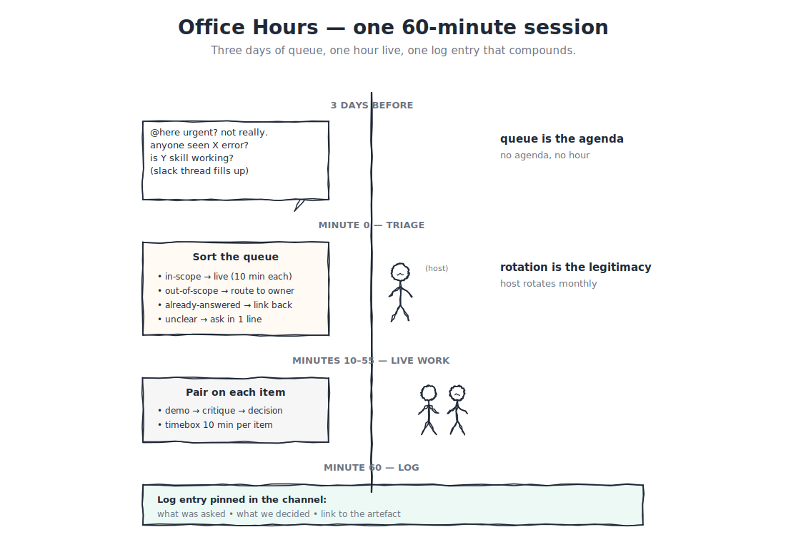

# B.12 — Running office hours: the Whoop / Ramp pattern

The opening module of Part C, and the voice anchor for the rest. Where Parts A and B taught you to *build* leverage, Part C teaches you to make that leverage *propagate*. The cheapest move in the propagation toolkit is a published time slot where the rest of the org can come to you with their in-flight blockers. Done well, a single weekly hour saves dozens of one-off Slack threads and surfaces the gaps in your platform that no one would have raised in a 1:1.

Done badly, it is yet-another-ritual. This module covers the difference.



---

## If you're short on time

- Office hours are a **published, recurring slot** (one hour, weekly is the common cadence) where any builder can bring an in-flight problem and get a deliberate answer in front of the rest of the queue.
- The discipline that separates a useful office hour from a wasted hour is a **public queue**, **rotating hosts**, and a **redacted decision log** that prevents the same answer being given twice.
- Office hours are *not* a substitute for documentation, a forum for performance feedback, or a place to debug code that has not been git-pushed.

---

## Why this is a Black Belt module

You can build leverage as an individual contributor. You can ship a plugin two PODs adopt within a month (Quest B-1). You can contribute a Blade component or own a full-stack feature (Quest B-2). What separates "very strong individual contributor" from "force multiplier" is whether the leverage you build *propagates without your hand on every keyboard*.

Office hours are the cheapest propagation move available. They cost one hour a week. They scale to the size of the queue, not the size of the org. They produce a written artefact (the decision log) that compounds. And they create a publicly visible signal that the platform-builder is reachable — which is the prerequisite for the embedded sprints in B.13 and the RFC sponsorship in B.14.

A Black Belt who refuses to run office hours can still ship; what they cannot do is *propagate*. Part C is the propagation track.

---

## The mental model

```
   ┌────────────────────────────────────────────────────┐
   │              ONE OFFICE HOUR                         │
   ├────────────────────────────────────────────────────┤
   │                                                      │
   │   PRE-HOUR (async, ~10 min):                        │
   │     Public queue: anyone can drop a problem.        │
   │     Each entry: name, surface, what's been tried.   │
   │                                                      │
   │   THE HOUR (60 min):                                │
   │     Open with the queue. Triage:                    │
   │       - in-scope, do live (~10 min each)           │
   │       - out-of-scope, route to right channel       │
   │       - already answered, point at the log         │
   │     Live debugging in the open. Decisions called    │
   │     out loud so the rest of the room learns.        │
   │                                                      │
   │   POST-HOUR (~15 min):                              │
   │     Redacted decision log entry per item.           │
   │     Pinned in the program's primary Slack channel.  │
   │                                                      │
   └────────────────────────────────────────────────────┘
```

The pattern works because each phase has a clear deliverable. No queue → no agenda. No live decisions → no learning. No log → the next person asking the same question repeats the cost.

---

## The three patterns this builds on

**The Whoop pattern.** Whoop's engineering team published the office-hours model where senior builders rotate hosting and the decision log is the durable artefact. The published example: a weekly slot, a public queue thread, hosts rotating monthly, and a "we already answered this" filter on intake.

**The Ramp pattern.** Ramp's platform team adapted office hours for a fast-growing eng org by making the *redacted* decision log the centrepiece: entries name the surface and the decision, but not the team or builder, so the log compounds without becoming gossip-shaped.

**The Razorpay shape.** Combining both: a weekly slot in the program's main forum, a public queue thread, a host rotation that includes builders from at least two PODs (so the office hour is not "the platform team's office hour"), and a redacted decision log pinned in the primary channel.

The order matters. The published slot is the entry point. The public queue is the agenda. The rotation is the legitimacy. The log is the durable artefact.

---

## Worked example — a single 60-minute session

A typical office hour walked end-to-end.

**Pre-hour (the queue).** Three days before the slot, a thread is open in [`#claude-onboarding-support`](https://razorpay.slack.com/archives/C0ANCMTCJA2): "Office hours Thursday 4pm — drop your blocker here." By Thursday morning the queue has six entries:

- "skill pack `foo` v1.2 install fails on the corp-proxy laptop";
- "MCP server timing out under load — is the rate-limit policy something we set?";
- "Blade compliance reviewer flags my dialog as RED but the design partner approved it — who's right?";
- "I want to deprecate the `bar` skill — what's the right deprecation path?";
- "Cost dashboard shows my team at 3x last month — is something wrong?";
- "Can I write an AI RFC for adding a new connector? Where do I start?".

**Triage (5 minutes).** The host reads the queue, classifies each:

- skill-pack install — in-scope, live debug (~10 min);
- MCP rate-limit — in-scope, the answer is in a previous log entry (point at it);
- Blade compliance disagreement — out-of-scope, route to [`#design-system`](https://razorpay.slack.com/archives/CMQ3RBHEU);
- deprecation path — in-scope, walk the lifecycle (~10 min); will become a B.16 case study;
- cost dashboard — in-scope, live debug (~10 min);
- AI RFC starter — in-scope, walk the template (~10 min); will become a B.14 callout.

**The hour (the live work).** Items are walked in order, with the room learning alongside:

- the install failure turns out to be a corp-proxy cert that needs re-trusting; the fix is documented in B.16's "common pitfalls" (the host references the existing guidance instead of re-deriving);
- the deprecation walk produces a written timeline the asker copies into their team's tracker;
- the cost-dashboard debug reveals the asker's team forgot to attribute a long-running agent's calls to its workflow — exactly the pattern B.10 names; the host records this in the log so the next team running into it can find it;
- the RFC starter walk references B.14 directly; the host volunteers to sponsor a draft if the asker wants.

**Post-hour (the log).** The host writes six entries (one per queue item). Each entry: surface, decision, link to relevant module if applicable. Names redacted; PODs anonymised when the issue is sensitive. The log entry for the cost-dashboard issue might read:

> *Surface: cost dashboard. Issue: a team's monthly cost showed 3x last month's value; investigation showed an agent's calls were not attributed to its workflow, so the rollup over-counted. Decision: B.10's per-workflow attribution pattern is the fix; the agent's `metadata.workflow_name` was missing. The team that hit this is now using the pattern. Future teams seeing similar inflation should check workflow attribution first.*

The log entry takes ~3 minutes to write. The next team that hits the same issue saves ~30 minutes — and they find the answer themselves, without re-asking.

---

## What office hours are NOT

**Not a substitute for documentation.** A question that gets answered three times in three weeks belongs in the docs, not in the log. The host's job includes promoting log entries into permanent docs once a pattern is visible.

**Not a forum for performance feedback.** "I'm struggling to keep up with the team's velocity" is a 1:1 conversation, not an office-hours conversation. The host should redirect kindly and immediately.

**Not a place to debug code that has not been git-pushed.** Live debugging works when the room can see the code. If the asker has not pushed, the answer is "push, then re-queue."

**Not "the platform team's office hour."** If the host rotation only has platform-team builders, the office hour drifts toward platform-team work and away from the surfaces other PODs care about. The rotation should include cross-POD voices.

**Not optional after a month.** Office hours are a recurring commitment; cancelling because "the queue is light this week" is the wrong move. A light queue still produces a session — and absent that session, next week's queue will look light too. (When the queue is genuinely empty, the host uses the hour to write or update a log entry from a recent thread.)

**Not a venue for confidential or sensitive incidents.** A live security incident, a regulator-facing issue, or anything involving customer data goes through its own established channel: security review, the incident-response forum, the appropriate compliance channel. Office hours are the *normal-state* propagation forum, not the *abnormal-state* one. (See B.16 for the governance lifecycle that backs the abnormal-state forums.)

---

## How to start running office hours

A pattern that builders can copy.

**Week 0 (pre-launch).** Announce in [`#claude-onboarding-support`](https://razorpay.slack.com/archives/C0ANCMTCJA2): "Starting weekly AI office hours, Thursday 4pm, public queue, log pinned. First session is in two weeks." Lead time matters — readers need to see two announcements before they remember.

**Week 1 (queue test-fire).** Open the queue thread for the first session. If only one item comes in, that is the session — walk it deliberately. The first session establishes the *shape* of the artefact, not the *volume*.

**Week 2 onwards (steady state).** The queue thread opens three days before each session. The host (initially you; rotating after week four) triages the night before. The session runs the hour. The log is written within 24 hours of the session.

**Month 2 (rotation).** Invite a builder from a different POD to co-host. Month 3, that builder hosts solo while you observe. Month 4, the rotation has three hosts; the office hour is no longer "yours."

**Month 6 (impact check).** Read the log end-to-end. Count the entries. Mark the entries where the answer is now in permanent docs (those are the wins). Mark the entries where the same answer appeared more than twice (those are the docs the office hour is now telling you to write). Refactor the docs. Continue.

---

## The decision log — what it is, what it is not

The log is the durable artefact. Without it, the office hour is a one-time event that helps only the people in the room. With it, the office hour is a compounding asset.

**What the log is.** A pinned message (or a Slack canvas, or a wiki page — whichever the program's main forum supports) with one entry per item. Each entry: surface, decision, references. Names redacted; PODs anonymised when the issue is sensitive. The log is *append-only* — corrections are new entries that reference the prior entry, not edits to history.

**What the log is not.** It is not the docs. It is not the source of truth for the platform's behaviour. It is a *running ledger of decisions* that points at the docs when they exist and prompts new docs when they do not. Treating the log as the docs is a common failure mode (see below).

**The redaction rule.** Names of individuals: redacted. POD identifiers: anonymised when the issue is sensitive (e.g., compliance-shaped, performance-shaped). When the entry is purely technical and naming the POD adds context (e.g., "the dashboard team hit this because they share a service with the analytics team"), the host can decide; the default is to anonymise and revisit if a reader asks.

**The retention rule.** Entries are not deleted. When a log entry's content is fully promoted into permanent docs, the entry stays as a pointer ("this answer now lives in [doc link]"). The lineage is part of the artefact.

---

## Common failure modes

**Letting the queue go private.** A queue in DMs is not a queue; it is a private support channel that does not propagate. Fix: the queue thread is in [`#claude-onboarding-support`](https://razorpay.slack.com/archives/C0ANCMTCJA2); private requests get redirected ("post in the queue, the same answer will help others").

**Not rotating the host.** When the same builder hosts every week, the office hour becomes the host's surface area, not the platform's. Burnout follows. Fix: rotate from month four; involve cross-POD voices.

**Skipping the log.** The session helps the room and no one else. Fix: 15 minutes after the hour, every time. If you cannot afford 15 minutes, you cannot afford the office hour.

**Treating the log as the docs.** A reader looking for the canonical answer gets a partial running ledger instead. Fix: log entries point at docs; recurring questions become doc updates; the host owns the doc-promotion path.

**Cancelling on light weeks.** Sets the expectation that the office hour is optional. Fix: a light queue still produces a session — write or refactor a log entry, do not skip.

**Hosting without preparation.** A host who reads the queue for the first time at the start of the hour wastes the room's time. Fix: the host triages the night before; surprise items still happen, but the queue is read in advance.

**Letting the hour bleed.** A 60-minute slot that runs to 90 minutes routinely is a slot that needs a different format. Fix: a strict 60 minutes; items that need more time get a follow-up booking, not the live slot.

**Confusing office hours with mentoring.** A builder who wants ongoing 1:1 mentorship does not belong in the public queue. Fix: redirect to the appropriate forum. The mentoring path lives elsewhere (Black Belt and Staff+ Council candidates have explicit mentoring patterns documented in C.4).

---

## GREEN / YELLOW / RED self-check

- 🟢 GREEN: I run a weekly office hour with a public queue, rotating hosts, and a pinned redacted decision log; the log compounds; the log is feeding the docs.
- 🟡 YELLOW — I run office hours but the queue or the log is missing; the hour helps the room and stops there.
- 🔴 RED — I do not run office hours, or I run an "open door" pattern that is actually a private DM channel.

---

## What you can say after this module

> "I run a weekly office hour with a published slot, a public queue, a host rotation, and a redacted decision log. The log compounds; the docs grow from it; the propagation cost of platform answers across the org is going down."

---

## Where to go next

Office hours surface blockers. Sometimes the blocker is bigger than a one-hour answer — the asker needs help across a week, not a session. That is what B.13 (Embedded sprints) covers: the time-boxed, ship-with-the-team pattern.

**Previous:** [← Part C README](README.md) · **Next:** [→ B.13 Embedded sprints](B13-embedded-sprints.md)

**Further reading**

- [B.10 — Cost + observability](../b-craft/B10-cost-and-observability.md) — the dashboards that recurring office-hours questions feed.
- [B.13 — Embedded sprints](B13-embedded-sprints.md) — the next propagation move when an office-hours conversation needs more time.
- [B.16 — Plugin + skill governance](B16-plugin-and-skill-governance.md) — the lifecycle moves that office-hours questions surface.
- [Appendix L — Certification](../../../appendices/L-certification/README.md) — the reviewer protocol that office-hours hosts apply when fielding belt-claim-shaped questions.
