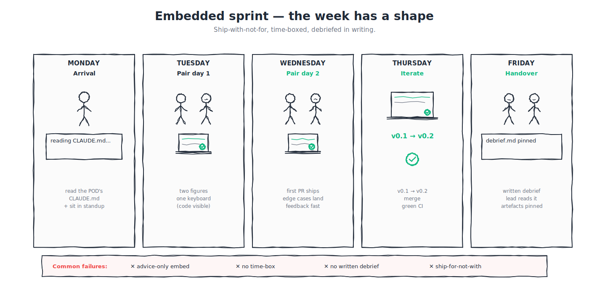

# B.13 — Embedded sprints: the CTO-with-a-team week

Where B.12 surfaces blockers in a weekly slot, B.13 covers the next propagation move: when a POD's blocker is bigger than a session (when they need a senior builder *alongside them* for a week) the embedded sprint is the named pattern.

The pattern comes from staff-engineer literature: a senior individual contributor embeds with a team outside their own, time-boxed, and ships *with* the team. Not for them. Not as a consultant who emails a memo at the end. As a builder who shows up Monday, takes a row in the team's tracker, and pushes commits.



---

## If you're short on time

- An embedded sprint is **time-boxed (one week, not "as long as it takes")**, **ship-with-not-for** (the deliverable is shared work, not advice), and **debriefed in writing** (so the next embed inherits the lessons).
- The pattern propagates *cross-POD knowledge*: the embedding builder reads how the host POD actually works; the host POD gets a senior builder alongside them; the platform team gets an honest read of where the platform is leaky.
- Embedded sprints are *not* code-review tours, free-floating audits, or pretexts for a strategy memo.

---

## Why this is a Black Belt module

The Black Belt promise is *force multiplier*. Office hours (B.12) propagate answers across a POD set in 60-minute increments. Embedded sprints propagate *the way a senior builder works* across an entire team in a one-week increment. The difference is depth: in an office hour you can answer a question; in an embedded sprint you can change how the host POD ships.

A platform team that has authored an MCP, a shared skill, and a custom agent (Quest B-1) and that has shipped a Blade contribution or a full-stack feature (Quest B-2) is well-equipped to *teach* but only marginally equipped to *spread*. Spread requires showing up. Spread requires sharing the keyboard.

Embedded sprints are also one of the inputs to Boss Fight B-B — a one-month POD-AI-uplift embed is a *month-long* version of this pattern with a measurable outcome.

---

## The mental model

```
   ┌────────────────────────────────────────────────────┐
   │           ONE EMBEDDED SPRINT (1 WEEK)              │
   ├────────────────────────────────────────────────────┤
   │                                                      │
   │   PRE-WEEK (~1 hour, async):                        │
   │     Host POD lead names: deliverable, owner-pair,    │
   │     constraints, what done looks like.              │
   │                                                      │
   │   MONDAY:                                            │
   │     Embed introduces self. Reads the team's          │
   │     CLAUDE.md, the team's last week's PRs, the       │
   │     team's ticket queue. Pairs with assigned         │
   │     builder. Picks up a row in the tracker.          │
   │                                                      │
   │   TUESDAY-THURSDAY:                                  │
   │     Pair-program. Push commits. Attend the team's    │
   │     standup. Listen for what the team finds hard.    │
   │     Take notes for the debrief.                      │
   │                                                      │
   │   FRIDAY:                                            │
   │     Land the deliverable (or document why not).      │
   │     Write the debrief. Walk it with the host lead.   │
   │     Pin the debrief.                                 │
   │                                                      │
   └────────────────────────────────────────────────────┘
```

The week has a shape. Without the shape, the embed becomes "a senior builder hangs out with a team and gives advice": which produces no artefact, no propagation, and no measurable outcome.

---

## The three discipline rules

**Time-boxed.** One week, not "as long as it takes." A two-week embed becomes a four-week embed becomes the embedding builder is now a member of the host team. The time box is the value: it forces the work to ship by Friday and prevents the embed from becoming a permanent transfer.

**Ship-with-not-for.** The deliverable must be a piece of *shared* work (a feature, an automation, a documented practice) that the embedded builder pairs with a host-POD builder to produce. "I told them to use X" does not count. "We pair-programmed X and merged it together" counts.

**Debriefed in writing.** Friday produces a written debrief covering: the deliverable, what was harder than expected, what the platform team should fix, what the host POD should keep doing, what the next embed should know. The debrief is pinned in the program's main forum so the next embed reads it before they start.

The three rules interact. Time-box without ship-with means the embed produces advice and leaves; ship-with without time-box means the embed never ends; either of them without the debrief means the lessons evaporate.

---

## Worked example — a one-week embed

A representative shape (no real team names).

**Pre-week.** Embedding builder reaches out to host POD lead. They scope:

- *deliverable:* host POD has a recurring weekly status report that takes a builder ~3 hours; can the embed automate it via a shared skill so the time goes to ~30 minutes?
- *owner-pair:* embedding builder + a mid-level builder on the host team;
- *constraints:* publish through `razorpay/agent-skills`; must not depend on any data the host team does not already have access to;
- *done:* the skill is merged, the host team has run it on two consecutive weekly reports, and the time-saved measurement is logged.

The pre-week conversation takes 45 minutes; without it, Monday is wasted on scoping.

**Monday.** Embed reads the host POD's CLAUDE.md, last week's PRs, the relevant Slack channels. Pairs with the mid-level builder. They walk the manual report-writing flow together; the embed asks "what is annoying about this?" and takes notes. By end-of-day they have a sketch for the shared skill: triggers (the report deadline), inputs (the team's tracker, the team's primary Slack channel), outputs (a Markdown report in the team's standard shape), failure modes (when the tracker has no entries, when the Slack channel has no relevant messages).

**Tuesday-Wednesday.** They author the skill's `SKILL.md` (per G.7), add references or scripts only where needed, and run the repository validation plus acceptance scenarios. The embed shows the mid-level builder how to apply progressive disclosure (per B.7). They open an `agent-skills` PR for the owning team's review.

**Thursday.** They run the skill on the actual weekly report. It works for 80% of the content; the 20% that fails is in cases where the team's tracker uses a non-standard label. They update the PR to handle the edge case. The mid-level builder owns the PR; the embed reviews. The host team's lead approves.

**Friday morning.** The skill merges. The mid-level builder clean-installs it, runs it on the *next* week's report (in advance), times it, and logs the result: 40 minutes vs the historical 3 hours.

**Friday afternoon.** The embed writes the debrief:

- *deliverable:* `weekly-status` skill merged to `razorpay/agent-skills`; ~85% time saving on the recurring report;
- *what was harder than expected:* the host POD's tracker has three label variants for the same concept; this is a documentation gap, not an AI gap, and the host POD should standardise;
- *what the platform team should fix:* the shared-library install path had a small friction issue on the host POD's setup that wasted ~30 minutes; ticket filed;
- *what the host POD should keep doing:* the team's CLAUDE.md is unusually well-written, which made the embed possible in one week; this is a model;
- *what the next embed should know:* if the host team has a non-standard tracker pattern, build the SKILL.md to detect-and-redirect rather than assuming the standard.

The debrief is ~600 words. Pinned in the program's main forum. The next embed (a different builder, embedding with a different POD a month later) reads it as part of their own pre-week.

---

## What an embedded sprint is NOT

**Not a code-review tour.** A senior builder visiting a team to read their PRs and offer comments is a code review, not an embed. Code review is async, low-bandwidth, and does not produce a debrief.

**Not a free-floating audit.** Embeds are *invited* and *scoped*. An audit imposed on a team produces resentment and bad-faith engagement; an embed agreed in pre-week produces collaboration.

**Not a pretext for a strategy memo.** "I embedded for a week and now I've written 5,000 words about what's wrong with the platform" is a memo, not an embed. The memo can be a follow-up; the embed's deliverable is shared work.

**Not a permanent transfer.** A builder who keeps embedding with the same team week after week has effectively transferred. That is fine if it is what both sides want, but it is no longer an embedded sprint.

**Not a substitute for hiring.** When the host POD is short-staffed, an embed papers over the gap for a week and then leaves. Solving the staffing problem is a different conversation; the embed's job is to make the team's work more leveraged, not to be a temporary hire.

**Not a venue for surfacing performance issues with host-team members.** The embed is in the team to ship together, not to evaluate. Observations about a host-POD builder's work belong in a 1:1 between that builder and their manager, not in the debrief.

---

## How to start running embedded sprints

The pattern that builders can copy. Two starting paths.

**Path A — The first invitation.** A POD lead asks for help with a specific challenge. You agree to a one-week embed with explicit scope (the pre-week conversation). You ship Monday-Thursday, debrief Friday. Pin the debrief. The next POD lead reads it and asks for the same shape.

**Path B — The first offer.** No POD has asked yet, but you see a recurring need (e.g., the office-hours queue keeps surfacing the same kind of question for a particular surface). You offer: "I can embed for a week with a team that hits this; pre-week conversation first to scope." The first taker is almost always the team that wanted the help but did not know to ask.

**Frequency.** A single Black Belt cannot sustainably embed more than once a quarter; the work week away is real. Cohorts of Black Belts can rotate so that *some* Black Belt is embedded with *some* POD every couple of weeks across the program.

**Visibility.** The embed schedule should be visible in the program's main forum so the rest of the org knows the pattern exists and how to request one.

---

## Common failure modes

**Pre-week conversation skipped.** Monday is spent scoping what should have been scoped before. Fix: 45-minute pre-week conversation, non-negotiable; if it cannot happen, the embed does not start.

**No assigned owner-pair on the host side.** The embedded builder has no one to pair with; ends up working alone in the host team's repo. Fix: pre-week conversation names the owner pair; if the host team cannot commit a builder to pair, the embed is not a fit yet.

**Time box bleeds.** The embed runs into a second week, then a third. Fix: the debrief on Friday is the cut-off, even if the deliverable is partial. A partial deliverable + a clear debrief is better than a complete deliverable that took three weeks.

**Ship-without-with.** The embedded builder writes the skill alone Tuesday-Thursday and hands it over Friday. Fix: pair from Monday; the *with* is the propagation mechanism. A skill handed over without pairing is just a contribution.

**Debrief written in private.** The lessons stay with the embed. Fix: debrief is pinned in the program's main forum; the next embed reads it before their pre-week.

**Embed-as-evaluation.** The embedding builder uses the debrief to assess the host POD's people. Fix: debriefs name *patterns* (the tracker has three label variants; the CLAUDE.md is unusually clean), not *people* (Builder X is slow; Builder Y is unclear).

**No measurement on the deliverable.** "We shipped a skill" is not the same as "we shipped a skill and measured an 85% time saving on the recurring report." Fix: measurement is part of "done"; if the deliverable cannot be measured, name what *can* be (e.g., "the team can now author this kind of shared skill independently — the next one took them three days instead of asking us for an embed").

---

## GREEN / YELLOW / RED self-check

- 🟢 GREEN: I have run at least one embedded sprint with a clear pre-week, a paired owner, a Friday-shipped deliverable, a measurement, and a pinned debrief; my pattern propagates.
- 🟡 YELLOW — I have done embeds but the pattern is informal; missing pre-week, missing measurement, or missing debrief.
- 🔴 RED — I have never embedded with a POD outside my own; my Black Belt work has stayed within my team.

---

## What you can say after this module

> "I run embedded sprints (time-boxed, ship-with-not-for, debriefed in writing) that propagate platform-builder patterns across PODs without my hand on every keyboard for longer than a week."

---

## Where to go next

Office hours and embedded sprints surface what *should change* across the platform. When a change needs alignment beyond a single embed (when it touches a shared connector, a shared policy, or the shared skill library) the next move is an AI RFC. B.14 covers the shape.

**Previous:** [← B.12 Running office hours](B12-running-office-hours.md) · **Next:** [→ B.14 Writing an AI RFC](B14-writing-an-ai-rfc.md)

**Further reading**

- [Staff-engineer literature on embedded patterns](https://staffeng.com/) — public reference for the time-boxed-embed pattern.
- [B.7 — Progressive disclosure](../b-craft/B07-progressive-disclosure.md) — the skill-authoring discipline that embeds teach by example.
- [B.12 — Running office hours](B12-running-office-hours.md) — the predecessor propagation move.
- [Boss Fight B-B](boss-fight-BB-pod-ai-uplift.md) — the month-long version of this pattern with a measurable outcome.
