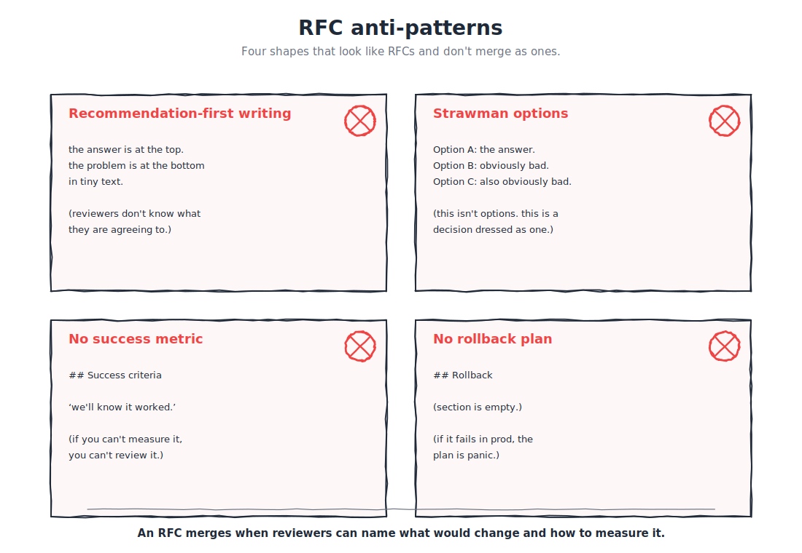

# B.14 — Writing an AI RFC: what good looks like at Razorpay

The first governance module of Part C. Where B.12 (office hours) and B.13 (embedded sprints) propagate platform-builder patterns through cultural moves, B.14 covers the *written* propagation move: when a change touches the program's shared AI surface — a new connector, a new policy, a structural change to the shared skill library, a new model-routing decision — the change earns a merge through an RFC.

An RFC merges when reviewers can name what would change and how to measure whether it worked. That is the bar.

---

## If you're short on time

- An AI RFC is a **written proposal** for a change to the program's AI surface: naming the problem, the options, the recommendation, the cost-and-risk, the rollout plan, the success metric, and the rollback plan.
- The bar: an RFC merges when reviewers can name **what would change** and **how to measure whether it worked**. Vibes RFCs do not merge.
- Write the RFC **before** you build, not as post-hoc justification. If the building has started, the RFC is documenting decisions, not making them — say so explicitly.

---

## Why this is a Black Belt module

Most builders in the org will never write an RFC. They will build features, ship PRs, claim Yellow and Green Belt. RFCs are for changes that affect *more than one team's surface area*. A new connector class in the program-pinned plugin affects every team that installs the plugin. A new model-routing policy affects every call that goes through the proxy. A new policy on which kinds of data can flow through agents affects every team's compliance posture.

A Black Belt writes the RFC for changes of that shape. Not because they have authority (RFCs are a *process*, not a hierarchy) but because they have the platform-shaped context needed to author a proposal that survives review.

The skill is not "writing well" in general. The skill is *naming the change clearly enough that reviewers can converge*.

---

## The mental model — the seven sections

```
   ┌────────────────────────────────────────────────┐
   │              ONE AI RFC                          │
   ├────────────────────────────────────────────────┤
   │                                                  │
   │   1. PROBLEM STATEMENT                           │
   │      What is broken / missing / costly today?  │
   │                                                  │
   │   2. OPTIONS CONSIDERED                          │
   │      ≥3 options including "do nothing." Each    │
   │      with cost, risk, who pays.                 │
   │                                                  │
   │   3. RECOMMENDATION                              │
   │      The author's pick, with the reasoning.     │
   │                                                  │
   │   4. COST & RISK                                 │
   │      Engineering cost, ops cost, risk surface.  │
   │                                                  │
   │   5. ROLLOUT PLAN                                │
   │      How the change gets to production.         │
   │                                                  │
   │   6. SUCCESS METRIC                              │
   │      How we know it worked.                     │
   │                                                  │
   │   7. ROLLBACK PLAN                               │
   │      How we undo it if the metric goes wrong.   │
   │                                                  │
   └────────────────────────────────────────────────┘
```

The seven sections are non-negotiable. Skipping any one of them produces an RFC that reviewers cannot evaluate. Skip the success metric and you cannot tell whether the change worked. Skip the rollback plan and you cannot tell whether the change is reversible. Skip the options and reviewers cannot tell whether the recommendation is the *best* option or just *an* option.

---

## Section by section

### 1. Problem statement

Two paragraphs. What is broken, missing, or costly today? Who pays the cost? When did it become a problem? If the problem only matters under specific conditions, name them.

The trap: starting with the recommendation and writing the problem statement to justify it. The reviewer can tell. The fix: write the problem statement *first*, walk away for a day, come back and ask "could the recommendation have been different?" If the answer is "no, only this fix works," the problem statement is not specific enough.

### 2. Options considered

At least three. The first option is always **do nothing** — what happens if we leave the situation as it is? If "do nothing" is genuinely fine, the RFC should not exist. If "do nothing" is bad, the RFC has its motivation.

Each option gets:

- a one-paragraph description;
- engineering cost (rough, in person-weeks);
- ops cost (recurring, per-month or per-call as appropriate);
- risk surface (what gets harder, who pays the risk);
- who reviews / approves / owns it.

The discipline: the options are *real* alternatives, not strawmen. If the RFC walks reviewers through three options where two are obviously bad, the reviewers will assume the author has not done the work.

### 3. Recommendation

The author's pick from the options, with the reasoning made explicit. "Option B because the engineering cost is lower than Option A and the ops cost is lower than Option C; the risk surface is comparable to Option A and smaller than Option C; the reviewer pool aligns with the team that would own it long-term."

The reasoning should be *re-derivable* from the options-considered table. If the recommendation references something the options table did not name, the options table is incomplete.

### 4. Cost & risk

The recommendation's cost and risk *in detail*. Three sub-sections:

- **Engineering cost.** Rough person-weeks; team that would do the work; dependencies.
- **Ops cost.** Recurring monthly cost (compute, storage, third-party services); per-call cost if applicable; who pays.
- **Risk surface.** What gets harder; who pays the risk if it goes wrong; the worst-case failure mode.

The cost section is what API Council reviewers (per B.15) and security reviewers (per B.16) read first. Underestimating cost is the most common reason RFCs get bounced.

### 5. Rollout plan

The sequence of steps from "RFC merges" to "the change is in production." Typical shape:

- step 1: implementation behind a feature flag / opt-in path;
- step 2: validation on the platform team's own surface;
- step 3: rollout to N volunteer PODs;
- step 4: program-wide rollout once the metric is green;
- step 5: deprecation of the predecessor (if any).

Each step has a named owner and an expected duration. A rollout plan that says "ship it" without phasing is a red flag — large changes need phasing, and the phasing is what lets the success metric and rollback plan work.

### 6. Success metric

How we know the change worked. The metric should be *measurable*, *time-bounded*, and *agreed in advance*. "Adoption" is not a metric; "skill-pack `foo` installed by ≥3 PODs outside the platform team within 60 days of v1.0" is.

The discipline B.10 (cost + observability) names (that vibes are not enough) applies here. An RFC whose success metric is "the team likes it" cannot be evaluated; an RFC whose success metric is "median time-to-first-PR drops from X to Y on the surface this affects" can.

### 7. Rollback plan

If the metric is not green by the agreed time, what do we do? Three sub-sections:

- **Trigger.** What value of the metric (or what time horizon without the metric trending) triggers rollback?
- **Mechanism.** How is rollback executed? Feature-flag flip? Plugin version pin? Code revert?
- **Owner.** Who pulls the trigger and runs the mechanism?

The rollback plan is what makes the RFC *reversible*. An RFC without a rollback plan is asking reviewers to bet on the recommendation; with a rollback plan, reviewers are betting on the *commitment to evaluate*, which is a much smaller ask.

---

## Worked example — a shape, not a real RFC

A redacted shape. Names removed; numbers illustrative.

> **Title.** Adopting a new connector class for tracker integrations
>
> **Author.** Black Belt builder, Platform team. Date: 2026-05-XX.
>
> **Problem statement.** Three teams currently maintain custom MCP servers for their tracker integrations. Each maintainer has spent ~3 person-weeks on the integration; combined ops cost is ~$X/month for the three; the integrations diverge in subtle ways (auth handling, rate-limit policy) which surfaces as "why does this work for team A but not team B" in the office-hours queue with rising frequency.
>
> **Options considered.** *Option 0 (do nothing):* the three teams continue maintaining their integrations; cost continues; office-hours queue continues to surface divergence questions. *Option A (canonical connector class):* the platform team authors a canonical connector class that all three teams adopt; ~6 person-weeks of platform-team engineering; ~$X/month of ops cost saved on the canonical version; risk: the three teams' edge cases must all be handled. *Option B (vendor connector):* adopt the public vendor connector and accept the integration shape; ~2 person-weeks of platform-team engineering; ~$Y/month of new ops cost; risk: vendor connector does not handle a Razorpay-specific auth flow.
>
> **Recommendation.** Option A. The 6 person-weeks of platform-team engineering is amortised across three teams' maintenance going forward; the convergence solves the office-hours-queue divergence problem; the auth-flow risk in Option B is real and has bitten us before.
>
> **Cost & risk.** Engineering: 6 person-weeks across two builders. Ops: net savings of ~$Z/month after migration. Risk surface: the three teams' edge cases. Mitigation: pre-RFC, the platform team has confirmed the three edge cases via paired conversations; RFC includes the edge-case handling explicitly.
>
> **Rollout plan.** Step 1, weeks 1–6: implement the canonical connector class behind an opt-in flag. Step 2, week 7: dogfood on the platform team's own integration. Step 3, weeks 8–10: migrate the three teams in sequence (one per week), each migration owner-paired. Step 4, week 11: turn on the flag by default; old integrations stay opt-out for two more weeks. Step 5, week 13: deprecate the per-team integrations.
>
> **Success metric.** By week 13: (a) all three teams migrated; (b) zero divergence-shaped questions in the office-hours queue for two consecutive weeks; (c) ops cost lower than baseline by ≥$Z/month.
>
> **Rollback plan.** Trigger: any of the three migrations rolls back due to edge-case breakage that takes >1 week to fix; or ops cost is higher than baseline at week 13. Mechanism: the opt-in flag flips to default-off; the three teams' original integrations remain in place. Owner: the RFC author.

The RFC is ~600 words. It does not solve the change; it *commits to a shape* the reviewers can evaluate.

---

## Where the RFC lives

Razorpay has an RFC process; the program's AI-shaped RFCs flow through the program's primary RFC forum (the role-level reference, not a URL). The shape of where the RFC lives is the program's responsibility; this module's responsibility is the shape of the RFC itself.

The AI-RFC-specific notes:

- **Pre-RFC conversation.** Before posting, walk the recommendation with one or two reviewers privately. Their feedback shapes the public RFC; you are not dodging review, you are de-risking the public version.
- **Reviewer pool.** AI-shaped RFCs typically need: a Black Belt or Council member from the platform-builder community, a security reviewer (per B.16) if the change touches data flow, an API-council voice (per B.15) if the change touches an AI-facing API surface.
- **Comment-threading discipline.** RFC comments are public and last. Author responds to every substantive comment (not every comment — substantive ones); "won't address" with a reason is a valid response. The thread becomes part of the RFC's record.
- **Merge criterion.** The RFC merges when reviewers can name what would change and how to measure whether it worked. If a reviewer cannot answer either question after reading, the RFC is not yet ready to merge.

---

## Common failure modes



**Recommendation-first writing.** The problem statement is engineered to support the recommendation. Reviewers smell it; the RFC bounces. Fix: write the problem statement before the recommendation; walk away; check.

**Strawman options.** Option B and C exist only to make Option A look good. Reviewers smell it; the RFC bounces. Fix: real alternatives, with their genuine pros listed.

**No success metric.** "Adoption will be high" is not a metric. Fix: a measurable, time-bounded, agreed-in-advance metric per Section 6.

**No rollback plan.** Reviewers cannot accept an RFC that bets the platform on a one-way decision. Fix: name the trigger, the mechanism, and the owner per Section 7.

**Cost underestimated.** Ops cost is named at "small" without a number. Engineering cost is named in days when it should be in weeks. Fix: rough person-weeks; rough monthly costs; reviewers will tighten.

**Scope creep mid-RFC.** Reviewer comments suggest expanding scope; author agrees and adds; the RFC now needs new options analysis. Fix: a comment that suggests a meaningfully larger change is a *different RFC*; respond with "good call, will be a follow-up RFC."

**Skipping the pre-RFC conversation.** First time reviewers see the recommendation is the public post; the comments thrash. Fix: 30–60 minutes with one or two reviewers before posting.

**Documenting decisions instead of making them.** The team has been building the change for a month and the RFC is post-hoc. Fix: say so explicitly in the RFC ("this RFC documents decisions already made; the purpose is to capture context, not to gate the change"). Reviewers can then evaluate appropriately.

**No explicit reviewer pool.** Author posts and waits; the wrong reviewers comment; the right reviewers miss it. Fix: tag the reviewer pool explicitly in the post.

---

## What this is not

**Not a substitute for a design doc.** A design doc is more detailed; an RFC names the *decision*. A change might need both — design doc first, RFC for the cross-team-affecting decisions.

**Not a substitute for security review.** When the change touches data flow or new connectors handling sensitive data, the security review in B.16 still applies. The RFC names the need; the security review evaluates the change.

**Not a substitute for API Council review.** When the change introduces a new AI-facing API surface, the API Council review in B.15 still applies; this module's RFC pattern is *complementary* to the API Council, not a replacement.

**Not a venue for opinions without proposals.** "I think we should think about X" is a discussion; an RFC is a *proposal*. If the proposal is "let's start a conversation about X," the RFC is not the right shape.

**Not a hierarchy.** Anyone can author an RFC. Anyone can review. The Black Belt's role is *frequently* to author RFCs of platform-shaped changes, not *exclusively*.

---

## A note on templates

The canonical RFC template lives at [Appendix I — RFC template](../../../appendices/I-templates/RFC-template.md); the seven sections above are the body. Copy the template, fill in the blanks, walk away, come back, edit. The shape is more important than the formatting.

---

## GREEN / YELLOW / RED self-check

- 🟢 GREEN: I have authored at least one AI RFC that walked the seven sections, surfaced real options, named a measurable success metric, included a rollback plan, and merged through the program's primary RFC forum.
- 🟡 YELLOW — I have authored RFCs but they have skipped sections (no rollback plan; vague metric; strawman options); reviewers have made me iterate.
- 🔴 RED — I have not authored an AI RFC, or I have written discussion documents and called them RFCs.

---

## What you can say after this module

> "I write AI RFCs that walk the seven sections, name what would change and how to measure whether it worked, surface real alternatives with real costs, and include a rollback plan; my RFCs merge through the program's main forum because reviewers can converge on them."

---

## Where to go next

When the change you are RFC-ing introduces a new AI-facing API surface (an MCP server, an agent's tool schema, a public-facing AI surface) there is one more reviewer pool to engage: the API Council, with an AI-specific lens. B.15 covers the shape.

**Previous:** [← B.13 Embedded sprints](B13-embedded-sprints.md) · **Next:** [→ B.15 API Council contributions](B15-api-council-contributions.md)

**Further reading**

- [B.6 — Tool design](../a-platform/B06-tool-design.md) — the tool-shape discipline that AI-API-Council RFCs build on.
- [B.10 — Cost + observability](../b-craft/B10-cost-and-observability.md) — the measurement discipline that backs Section 6's success metrics.
- [B.16 — Plugin + skill governance](B16-plugin-and-skill-governance.md) — the lifecycle that RFCs unlock.
- [Appendix I — RFC template](../../../appendices/I-templates/RFC-template.md) — copy this canonical template to start an AI RFC.
