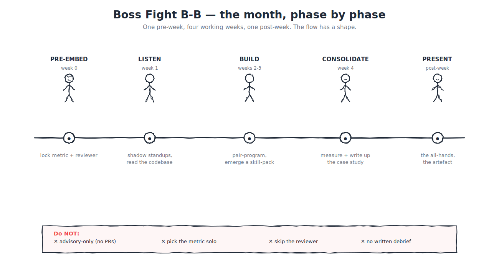

# 🏁 Boss Fight B-B — Own a POD's AI uplift for a month

> **Belt progress:** the closer of Black Belt
> **Time budget:** ~1 calendar month elapsed; ~2-4 active hours per week of pairing + the case-study writing
> **Prerequisite:** Black Belt Parts A, B, and C read; Quests B-1 and B-2 claimed; nomination registered
> **What you'll prove:** that the leverage you have built propagates *with you in the room* — that a POD outside your own can move materially faster on a metric *they* care about because of the moves you make over a month, and that the lift is real, measured, and reproducible



---

## What this boss fight is

The Black Belt capstone. INDEX commits the success criterion: **a signed-off metric lift plus a one-pager case study contributed to this playbook**. The boss fight is to embed with a POD outside the candidate's own for one calendar month, pick a shared metric *with the POD lead*, intervene through the full Black Belt toolkit (Parts A, B, and C in concert), measure the lift, write the case study, and present in an all-hands or the program's main forum.

This is the moment where Black Belt's promise (*I am a force multiplier for Razorpay*) is tested with evidence rather than self-report. Quests B-1 and B-2 prove cross-POD adoption (B-1) and cross-layer ownership (B-2). The boss fight proves *cross-POD impact*.

---

## What does NOT count

- Embedding with the candidate's own team or with a team that shares the candidate's manager.
- Picking the metric unilaterally; the metric must be the POD's, signed off by the POD lead before the embed begins.
- A metric that moves on its own (e.g., "PRs merged" during a quarter where the POD's headcount doubled) without controlling for the underlying change.
- A lift claim that cannot be reproduced: no baseline measurement, metric tracked differently pre and post, or one-off conditions during the embed window.
- A case study that names individuals, exposes regulator-protected data, or relies on numbers the POD lead has not approved for sharing.
- A purely advisory intervention — "I told them to use X." The candidate must have *built or shipped* something during the embed (a shared skill, an MCP, a custom agent, a documented practice that the POD now uses).
- A boss fight that lacks a Black-Belt-or-above reviewer in the chain (per Appendix L).

---

## How to do it

### Phase 0 — Pre-embed (~1-2 weeks before)

**Find a POD.** The candidate identifies a POD outside their immediate team that has a measurable challenge they could plausibly help with. Channels: the office-hours queue (B.12), the embedded-sprint debrief logs (B.13), direct outreach by a POD lead, or a cohort-lead-suggested match.

The POD lead must be a willing partner. A reluctant POD will not produce signal; the boss fight is not a one-sided mandate.

**Pick the metric.** With the POD lead, in writing. The metric is the *POD's* business metric — what they are already tracking or what they would track if the data were available. Examples (illustrative):

- median time-to-first-commit for new builders joining the POD;
- PRs merged per builder per week (controlled for headcount);
- cycle time on a defined ticket class;
- skill-trace count (how often the POD invokes shared skills);
- a Voice-of-Customer metric the POD already publishes.

The metric *cannot* be one the candidate proposes unilaterally. The POD lead's sign-off ensures the metric is one the POD genuinely cares about, which means the lift will be one they will *defend* in the all-hands.

**Establish the baseline.** With the POD lead, in writing, before the embed begins. The baseline is what the metric was over the most-recent comparable window — typically the four weeks preceding the embed. Documented in the same place the metric is documented. Numbers shared with the candidate.

**Scope the intervention.** A rough sketch (the full plan emerges during the embed) naming what the candidate expects to do across the four weeks. Common shapes: a shared skill the POD adopts (per Quest B-1's pattern); an MCP integration the POD did not have; a set of office hours and one or two embedded sprints (per B.12 and B.13); a documented practice the POD then runs.

**Calendar.** The four weeks are blocked on the candidate's calendar. The POD lead's standups and sprint reviews are on the calendar. The all-hands or program-forum slot for the case-study share is booked tentatively.

### Phase 1 — Week 1 of the embed: orient and baseline-confirm

**Day 1.** The candidate joins the POD's standup. Reads the POD's CLAUDE.md (if it exists; if not, that may be one of the interventions). Reads the recent PRs. Reads the most relevant Slack channels. Pairs with the POD lead for 60 minutes on the metric: confirming the baseline, agreeing on the measurement methodology, agreeing on what would falsify the lift claim.

**Days 2-5.** The candidate observes. Joins meetings. Pairs with builders on existing work. Takes notes on what the POD finds hard. The first week is mostly listening — interventions that bypass the listening phase will land badly because they will not be the right interventions.

**End of week 1.** The candidate names *what they think the right interventions are* in a thread with the POD lead. The POD lead validates or challenges. The intervention plan is set.

### Phase 2 — Weeks 2 and 3: build and ship

**Build.** Shared skills, MCPs, custom agents, documented practices — whichever the intervention plan named. The candidate builds *with* the POD's builders, not for them — the same ship-with-not-for discipline as B.13's embedded sprints.

**Run cultural moves.** Office hours for the POD if relevant; embedded-sprint patterns for specific deliverables; tool teaching where it lands.

**Measure continuously.** The metric is tracked through the two weeks. Spikes and dips noted; possible causes named. The candidate is *not* trying to game the metric; they are trying to make it move.

**Document.** A running log: what was done, what worked, what did not. This becomes the raw material for the case study.

### Phase 3 — Week 4: consolidate, measure, write

**Days 1-2.** Last interventions. Deprecate anything that did not work. Hand over the things that did to the POD's builders so the lift is not dependent on the candidate's continued presence.

**Days 3-4.** Final measurement. The lift (if any) is calculated against the baseline. The methodology is documented; the numbers are shared with the POD lead for sign-off. If the lift is positive but small, that is fine — small lift is *real lift* and should be claimed honestly. If the lift is zero or negative, that is also fine for the boss fight — the case study is what matters; an honest "this did not move the metric, here is what we learned" is more valuable than a lift claim the reviewer cannot defend.

**Day 5.** Write the case study. One page (~600-800 words). Sections per the template below.

### Phase 4 — Post-embed: present and submit

**Present.** The case study is shared in an all-hands or the program's main forum. The presentation is short — 10 minutes plus questions. The POD lead is in the room (in person or async); the lift, if claimed, has their sign-off.

**Contribute the case study back to the playbook.** The case study lives in the playbook's case-study archive (a `case-studies/` directory adjacent to the appendices, created when the first case study lands). Future Black Belt candidates read past case studies as part of their pre-embed scope.

**Reviewer routing.** Per Appendix L. For Boss Fight B-B specifically: at least two reviewers, one of whom is out-of-team (per Appendix L's standard rule for Black Belt) *and* one of whom is Black-Belt-or-above (the boss-fight-specific stricter rule). The two reviewers can be the same person if that person satisfies both criteria; usually they are different.

---

## The case study template

A one-page (~600-800 words) artefact. Six sections.

```markdown
# Case Study: [POD identifier or anonymised name] AI uplift

**Embed window:** YYYY-MM-DD to YYYY-MM-DD (4 weeks)
**Candidate:** <handle>
**POD lead:** <handle>
**Reviewers:** <out-of-team reviewer handle>, <Black-Belt-or-above reviewer handle>

## 1. Problem

What was the POD trying to move? Why did they care? What was the baseline?

## 2. Intervention

What did the candidate do across the four weeks? Shared skills, MCPs, agents, cultural moves — name them.

## 3. Result

The lift, with the methodology. The baseline number, the post-embed number, the percentage change, the confidence (if applicable).

## 4. What would not have worked

A short paragraph naming an intervention that *did not* move the metric, or that the candidate considered and rejected. The honesty is part of the artefact's value.

## 5. What the next embed should know

One paragraph for future Black Belt candidates considering a similar embed. Lessons that compound across the program.

## 6. Sign-offs

POD lead's name, date, and a one-sentence "I confirm the baseline, the intervention, and the result as described."
Reviewers' names, dates, and a one-sentence "I have read the case study and the underlying evidence and find it consistent with the boss-fight rubric."
```

The template is shape-only; the content is the candidate's. A case study that strays significantly from this shape needs a reason in the reflection.

---

## Worked example — a case study shape

A representative shape (no real POD; numbers illustrative).

> **Problem.** The POD owns a recurring weekly status report that takes ~3 hours of a senior builder's time. The metric the lead picked: median time spent producing the weekly report.
>
> **Intervention.** Week 1 spent observing the report-writing flow. Week 2-3: authored a `weekly-status` skill that pulls from the POD's tracker and primary Slack channel and produces the report in the POD's standard format; paired with a mid-level builder on the authoring; merged it to `razorpay/agent-skills` after owning-team review. Week 4: helped the POD author a small `weekly-status-config` document that the skill consumes; deprecated three internal scripts the POD had been using ad-hoc; ran two office hours for the POD focused on shared-skill adoption.
>
> **Result.** Baseline: 3 hours per weekly report (4-week mean). Post-embed: 35 minutes per weekly report (2-week mean during weeks 5-6 post-embed). 80% time saving. Methodology: timed by the report-writer; recorded in the POD's tracker; signed off by the POD lead.
>
> **What would not have worked.** An off-the-shelf reporting tool. The POD lead and I considered it; the report's shape is specific enough that a generic tool would have produced a 50% time saving at best, and the team would have invested time learning the tool that they could re-invest in their own work instead.
>
> **What the next embed should know.** The POD's CLAUDE.md was unusually well-written, which made the embed possible in four weeks. A POD with a poor CLAUDE.md would need at least a fifth week, or the candidate should narrow the intervention to fit the four-week box. The pattern of "shadow week 1, build weeks 2-3, hand-over week 4" is robust; deviating from it (e.g., starting to build in week 1) cost a peer Black Belt their lift on a different embed.
>
> **Sign-offs.** POD lead, 2026-XX-XX. Reviewers: out-of-team reviewer 2026-XX-XX, Black Belt reviewer 2026-XX-XX.

The artefact is ~500 words. It is small on purpose. The next Black Belt candidate reads ten of these and understands the embed pattern across ten different POD shapes.

---

## Common pitfalls

**Picking the metric the candidate wants.** The lift then "happens" because the metric was reverse-engineered. Reviewers see through it. Fix: the POD lead picks the metric, in writing, before the embed.

**Measuring once instead of continuously.** The baseline and post-embed numbers compete; without continuous measurement, attribution is impossible. Fix: track the metric weekly through the embed and at least two weeks after.

**Over-claiming the intervention's contribution.** The metric moved 30%; the candidate claims credit for all 30%; in fact, the POD's headcount also grew 10% in the same window. Fix: name confounders honestly; if the metric moved for multiple reasons, name the multiple reasons.

**Skipping the case study because "the metric speaks for itself."** It does not. Future Black Belt candidates need the *narrative* that converted the intervention into the lift. Fix: 600-800 words; the case study is the artefact, not the metric on its own.

**Embedding with a POD that does not have a willing lead.** The POD goes through the motions; the lift is artificial; the case study is shallow. Fix: pre-embed conversation surfaces the willingness; if the POD lead is not enthusiastic, find a different POD.

**Treating the embed as a side-project on top of normal work.** The candidate is "embedded" in name; in practice still doing 100% of their original POD's work. Fix: the embed needs *meaningful* time — typically 50-80% of the four weeks is not realistic; 30-50% is. The candidate's home POD must accept the load shift.

**Confusing this boss fight with a permanent transfer.** The candidate enjoys the new POD and stays. That is a transfer, not a boss fight. Fix: the four-week box is binding; if a transfer makes sense, it is a separate conversation after the boss fight closes.

**Writing the case study in private and not contributing it back.** The lift exists for the candidate's tracker row only. Fix: the case study is contributed to the playbook's archive — that is the propagation mechanism for future candidates.

**Skipping the all-hands share.** The lift exists in the case study but not in the org's collective memory. Fix: the all-hands share is required by the boss-fight rubric; book the slot in pre-embed.

**Reviewer routing skipped.** A peer rubber-stamps. Fix: two reviewers per Appendix L's stricter rule for the boss fight; one out-of-team, one Black-Belt-or-above.

---

## Reviewer routing

Per [Appendix L](../../../appendices/L-certification/README.md). For Boss Fight B-B specifically: **two reviewers, one out-of-team and one Black-Belt-or-above**. The two reviewers can be the same person if that person satisfies both criteria; usually they are different. Reviewers attest:

- the embed began and ended on the named dates;
- the metric was picked by the POD lead, signed off in writing, before the embed began;
- the baseline measurement is documented and methodology is sound;
- the intervention is specific (built or shipped, not advisory);
- the lift claim is consistent with the documented evidence;
- the case study has been contributed to the playbook's archive;
- the all-hands share has happened (or is scheduled within two weeks of the boss-fight close).

If the lift is zero or negative, the boss fight can still be claimed *if* the case study honestly names what was attempted, what did not work, and what the next embed should learn. The reviewer's job is to evaluate the *honesty and rigor* of the artefact, not the size of the lift.

---

## Evidence template

Copy into your tracker or `LEARNER.md`:

```markdown
## Boss Fight B-B — Own a POD's AI uplift for a month

- Builder: <handle>
- Embed start: <YYYY-MM-DD>
- Embed end: <YYYY-MM-DD>
- POD identifier (or anonymised): <handle / identifier>
- POD lead: <handle>
- Metric chosen: <metric name>
- POD lead's metric sign-off: <link to written confirmation>
- Baseline: <value, methodology>
- Post-embed value: <value, methodology>
- Lift: <%, with confidence if applicable>
- Intervention summary: <link to running log or artefact list>
- Case-study link: <link to the playbook's case-study archive>
- All-hands share confirmation: <link or date>
- Reviewers: <out-of-team reviewer handle>, <Black-Belt-or-above reviewer handle>
- Reviewer attestations: <links>
```

The case study itself is the primary artefact. The reviewer attestations are the proof of the chain. The all-hands share is the proof of propagation.

---

## What you can say after this boss fight

> "I embedded with a POD outside my own for a month, picked a metric *they* cared about, intervened through shared skills and cultural moves, shipped a measurable lift signed off by the POD lead, wrote a case study contributed back to the playbook, and shared the result in an all-hands. The leverage I built propagated with me in the room; my Black Belt is what I built, not what I was given."

---

**Previous:** [← B.16 Plugin + skill governance](B16-plugin-and-skill-governance.md) · **Next:** [→ Black Belt badge](badge.md)

**Further reading**

- [B.12 — Running office hours](B12-running-office-hours.md) — the cultural move that often surfaces the right POD to embed with.
- [B.13 — Embedded sprints](B13-embedded-sprints.md) — the one-week pattern; the boss fight is the four-week version.
- [B.10 — Cost + observability](../b-craft/B10-cost-and-observability.md) — the measurement discipline the boss fight depends on.
- [Appendix L — Certification](../../../appendices/L-certification/README.md) — the reviewer rules for the boss-fight close-out.
