# C.3 — The RFC pipeline and the decision archive

The RFC pipeline is the most concrete operational artefact of the Council. Black Belt module B.14 covered how to write an AI RFC at the level of an individual proposal. This chapter covers what the Council does with RFCs once they enter the pipeline: the state machine, the review mechanics, the consensus model, and the archive that the pipeline produces over years.

The chapter draws on three primary sources. Bryan Cantrill's "Requests for Discussion" and the public Oxide Computer RFD archive establish the discussion-as-pull-request pattern. Square's blog post on their RFC process establishes the time-bounded comment window. IETF RFC 7282 ("On Consensus and Humming in the IETF") establishes the consensus model that distinguishes serious objections from majority opinion. Michael Nygard's Architecture Decision Records (ADR) pattern provides the lighter-weight per-decision artefact alternative.

## If you're short on time

An RFC is a numbered, immutable, append-only proposal document. It moves through an explicit state machine (draft, discussion, committed or abandoned). Discussion happens in pull-request review so it attaches to specific lines. Comments have a time-bounded window with an explicit close. Consensus means that all serious objections have been addressed, not that everyone votes yes. A single named approver is accountable for the decision. The archive is the teaching corpus the next cohort reads to understand why the program is the way it is.

## Why this exists

Engineering programs that operate without an RFC pipeline make decisions by Slack thread, hallway conversation, and individual influence. The decisions still happen; what is missing is the record. New engineers cannot reconstruct why the program is the way it is. Decisions taken three years ago get re-litigated because no one remembers the reasoning. Disagreements that were resolved in a specific context return when the context shifts.

Cantrill's framing in the Oxide RFD post is the most direct: the value of an RFC archive is not the individual decisions but the corpus. A new engineer reading the archive learns the program's *technical history* in a way that a wiki or a set of design docs does not capture. The archive is a teaching surface as well as a decision surface.

For the Council specifically, the RFC pipeline is also the surface where the body's advisory role becomes operational. The Council does not own decisions in the management chain. It owns *the shape of the conversation that produces decisions*. RFCs are how the conversation happens.

## The state machine

Five states. Adapted from Oxide's RFD process and Square's RFC pattern. Each state is explicit; movement between states is auditable.



<details>
<summary>Text version (for Markdown viewers that don't render SVG)</summary>

```
   ┌─────────────────────────────────────────────────────────┐
   │                                                           │
   │   DRAFT                                                   │
   │   ── Author works in their own branch.                   │
   │   ── Pre-RFC conversations with one or two reviewers.   │
   │                                                           │
   │       │                                                  │
   │       ▼                                                  │
   │                                                           │
   │   DISCUSSION                                              │
   │   ── PR opened. Discussion attaches to specific lines.   │
   │   ── Comment window is time-bounded with explicit close. │
   │   ── Reviewers raise objections; author responds.        │
   │                                                           │
   │       │                                                  │
   │       ▼                                                  │
   │                                                           │
   │   PUBLISHED                                               │
   │   ── Comment window has closed.                          │
   │   ── Approver evaluates whether all serious objections   │
   │      have been addressed.                                 │
   │                                                           │
   │       │                                                  │
   │       ├────────────► COMMITTED                          │
   │       │              ── Approved. RFC merged.            │
   │       │              ── Implementation can proceed.      │
   │       │                                                   │
   │       └────────────► ABANDONED                           │
   │                       ── Withdrawn by author or rejected. │
   │                       ── RFC stays in archive with       │
   │                          status and reason.              │
   │                                                           │
   └─────────────────────────────────────────────────────────┘
```

</details>

States are transitions, not labels. An RFC in *discussion* is not waiting; it is being actively reviewed. An RFC in *abandoned* is not gone; it is in the archive with a reason. The archive contains all RFCs in all states, not just the committed ones, because the abandoned ones teach the most.

## RFC numbering

Numbered, immutable, append-only. Drawn from Oxide's RFD process and the IETF's own conventions. Once an RFC has a number, it never loses it, even if abandoned. New RFCs get the next available number. Numbers are not reused.

The numbering matters because it makes the archive citable. RFC 0042 is a stable reference. The reference works in code comments, Slack threads, design docs, and engineer handbooks. A new engineer reading "this is the way per RFC 0042" can find the document, read the reasoning, and decide whether the reasoning still applies in the current context.

In a program that has just established a Council, the first RFC is typically the charter itself or the RFC pipeline definition. The second is often the first AI-program-shaped decision. By the tenth RFC, the archive is starting to be useful. By the fiftieth, the archive is the program's most valuable institutional memory artefact.

## What an RFC document contains

Adapted from B.14 with Council-specific additions:

- **Title and number.** The number is assigned at the moment the document enters draft state.
- **Author.** The individual or pair who wrote it.
- **Date.** When draft started, when discussion opened, when committed or abandoned.
- **State.** Current state per the state machine above.
- **Approver.** A single named Council member or senior engineer who is accountable for the call. Single approver is deliberate; Square's RFC post warns against distributed approval producing deadlock.
- **Problem statement.** Two paragraphs. What is broken or missing or costly today, who pays the cost, when it became a problem.
- **Options considered.** At least three including "do nothing". Each with cost, risk, and who pays.
- **Recommendation.** The author's pick with the reasoning made explicit.
- **Cost and risk.** Engineering cost in person-weeks, ops cost monthly, risk surface, mitigation.
- **Rollout plan.** The sequence from RFC committed to in production.
- **Success metric.** Measurable, time-bounded, agreed in advance.
- **Rollback plan.** Trigger, mechanism, owner.
- **Cited prior RFCs.** Direct references to RFCs whose decisions this RFC builds on or reverses.

The cited-prior-RFCs section is the discipline that turns the archive into a teaching corpus. Cantrill's post is explicit that without this, the archive becomes a graveyard. With it, each new RFC links into the program's technical history and the corpus compounds.

## Discussion in pull-request review

Discussion happens on the RFC's pull request, attached to specific lines of the document. This is the Oxide pattern, adapted for the program.

Why pull-request review specifically:

- **Comments attach to lines.** A reviewer disputing the cost estimate comments on the cost section. A reviewer challenging the recommendation comments on the recommendation. This makes resolution visible: the author either updates the line, responds with a justification, or marks the comment as addressed-without-change with a reason.
- **The thread is durable.** Six months later, a new engineer can read both the RFC and its discussion. Slack threads decay; pull-request comments persist.
- **The state of the document is auditable.** The pull request shows revisions, comment resolution, and approval status. There is a single source of truth for "is this RFC ready to merge."

Comments are *substantive*. The drive-by reviewer pattern (commenting on every RFC without context, slowing everything down without improving outcomes) is a named failure mode. Commenters who are not deeply engaged with the RFC's domain should ask the author for context before commenting, or refrain.

The author responds to every substantive comment. Not every comment; substantive ones. "Won't address" with a reason is a valid response. A comment that the author refuses to engage with becomes a structural objection that the approver evaluates at the consensus check (covered below).

## The time-bounded comment window

Square's contribution to the pattern. An explicit comment window prevents proposals from dying in indefinite review.

The window is named in the RFC itself: typically two weeks for routine RFCs, four weeks for ones with broad cross-team implications. The window opens when the RFC enters *discussion* state. The window closes on the named date. Comments after the close are noted but do not block the approval decision.

The window can be extended once with notice. Extensions become a pattern signal: an RFC that has its window extended twice is usually one that needs to be split, scoped down, or withdrawn.

The window discipline works because it prevents the "consensus theatre" failure mode IETF RFC 7282 describes: the room agrees on a proposal to end the meeting, then no one implements it because there was never real engagement. With a window, the engagement is timed and bounded.

## Consensus by addressed objections

The single most important concept in this chapter, and the one the literature is most explicit about.

IETF RFC 7282 ("On Consensus and Humming in the IETF") argues that consensus is not unanimity, and that the chair's job is to determine whether all serious objections have been addressed, not to count votes. The full text of RFC 7282 is short and worth reading; the operational summary:

- **Voting is rejected.** Counting yeses and nos in the comment thread is not how the decision is made. Voting produces majoritarian outcomes that override real technical concerns.
- **Serious objections must be addressed.** A reviewer who raises a substantive objection has the right to a substantive response. The response can be: the RFC is updated to address it, or the author explains why the objection is not load-bearing, or the approver decides that the objection is real but the trade-off favours the recommendation anyway.
- **Quiet does not equal agreement.** A reviewer who says nothing is not voting yes. The approver should consider whether the right reviewers have engaged at all.
- **The approver makes the call.** After the comment window closes, the named approver evaluates whether all serious objections have been addressed and decides committed or abandoned. The decision is logged with reasoning.

This model is harder than voting and easier than unanimous consent. It requires the approver to do real evaluative work; it does not require every reviewer to feel positive about the outcome. Reviewers whose objections are heard but overridden often disagree with the call and continue working with the team that takes the call. That is the working state of senior engineering decision-making.

The Council's role here is to ensure the consensus check is done seriously. A Council that approves RFCs with unaddressed serious objections produces an archive that subsequent engineers cannot trust. A Council that holds the consensus bar produces an archive that becomes the program's institutional memory.

## Single named approver

Each RFC has one named approver. Drawn from Square's pattern, supported by Cantrill at Oxide.

The approver is typically the Council member whose domain the RFC most directly affects. For an AI-platform RFC, this is a Council member with platform context. For an agent-design RFC, a Council member with agent context. The approver is chosen at the time the RFC enters discussion state and is named in the RFC document.

A single approver is deliberate. Distributed approval produces deadlock; whose yes counts? Whose no counts? Who breaks ties? With a single approver, the answer is explicit. The approver is accountable. If the call turns out to be wrong, the approver is the person who made it. The discipline is uncomfortable; the alternative is worse.

The approver is not the same as the author. An author who approves their own RFC has produced no consensus check. The approver and the author are explicitly different people on every RFC.

## The archive as teaching corpus

The pattern Oxide makes most explicit. The archive is not a decision log; it is a teaching surface for the next cohort.

What this looks like in practice:

- **New Council members read the most-cited RFCs first.** Each Council member, on accepting the invitation, walks through the ten or fifteen RFCs that the existing Council names as foundational. This is part of the onboarding shape.
- **New senior engineers read the archive selectively.** When a Black Belt joins or is promoted, they read the RFCs in their domain. The archive answers "why is the program the way it is" in their area.
- **Cited-prior-RFC discipline keeps the corpus connected.** Each new RFC cites prior RFCs that shaped its context. A reader who picks up RFC 0153 can follow the citations back to the foundational decisions that shaped its problem space.
- **The annual reading list.** At the annual charter revision, the Council names the five to ten RFCs that are most foundational in the past year. The list is published. New engineers and Black Belt candidates use it as a reading order.

The archive grows quietly. The first hundred RFCs are most of the work; the second hundred refine; the third hundred are case studies. By the time a program has produced two hundred RFCs, the archive is the program's clearest single artefact of how it thinks.

## Worked example — a redacted RFC walk

A representative shape. Names removed; numbers illustrative.

> **RFC 0087: Adopting a canonical connector class for tracker integrations**
>
> *Author.* A Black Belt platform engineer.
>
> *Approver.* A Council member whose domain is platform.
>
> *State, dates.* Discussion opened week 1, comment window two weeks, committed week 4.
>
> *Cited prior RFCs.* RFC 0042 (the program's MCP adoption decision), RFC 0061 (the original tracker MCP designs by individual teams).
>
> *Discussion summary.* Three substantive comment threads. (a) A reviewer challenged the engineering cost estimate (six person-weeks); the author updated to seven after re-scoping the auth-flow handling. (b) A reviewer asked whether the canonical class would handle a fourth team's needs that were not in the original three; the author confirmed yes after a private conversation. (c) A reviewer objected that the RFC should defer to the API Council on the connector's API surface; the approver agreed and the RFC was updated to require API Council review as a pre-rollout step. Several non-substantive comments were also resolved.
>
> *Approver's call.* Committed. The approver's note in the archive: "All three substantive objections addressed. Cost estimate revised. Edge-case handling confirmed. API Council review added as pre-rollout step. Recommendation stands."
>
> *Outcome.* Implementation proceeded per the rollout plan. Success metric (zero divergence-shaped questions in the office-hours queue for two consecutive weeks) was met by week 13.

The RFC took roughly four weeks of elapsed time. The author spent maybe twenty hours of focused work. The reviewers each spent two to four hours. The approver spent six. The total cost of the RFC is around forty engineer-hours; the value is a decision that all teams adopted, an archived reasoning trail, and a future RFC author who can cite RFC 0087 to ground their own proposal.

## Common failure modes

Drawn directly from the literature.

**The graveyard archive.** RFCs are written but no one reads them. New engineers cannot find the relevant prior reasoning. Fix: the cited-prior-RFC discipline and the annual reading list. Cantrill is direct that without these, the archive collapses.

**Consensus theatre.** The room agrees on a proposal to end the meeting, then no one implements it. RFC 7282's named original failure mode. Fix: the time-bounded comment window forces real engagement; the approver's consensus check requires substantive evaluation.

**The drive-by reviewer.** Senior engineers comment on every RFC without context, slowing everything down without improving outcomes. Fix: comments are substantive or absent; reviewers who comment without context are challenged at the next charter revision.

**The proposal that becomes a project plan.** RFCs that mutate from "should we do this" to "here is the implementation plan" lose the architectural reasoning. Fix: the RFC stays decision-focused; implementation plans live in separate documents that the RFC references.

**Approval bottlenecks.** One or two Council members are the approvers on every RFC; everything queues behind them. Fix: rotating approvers across domains; the charter names the rotation principle.

**Voting drift.** Reviewers and approvers default to counting thumbs because it is easier than the consensus-by-addressed-objections check. Fix: the charter cites RFC 7282 explicitly; the annual revision flags voting-shaped patterns.

**Window evasion.** RFCs whose comment windows are extended repeatedly until they die without explicit abandonment. Fix: extensions are a pattern signal; multiple extensions surface at the monthly Council session.

**Author-as-approver.** An RFC where the author and approver are the same person. Produces no consensus check. Fix: the discipline is non-negotiable; an author cannot approve their own RFC even if they are a Council member.

**Discussion in private.** Substantive review happens in DMs and the public PR sees only the resolved version. The archive is incomplete because the reasoning is missing. Fix: the discipline is that substantive review happens in the PR; private pre-RFC conversations are explicitly named as such in the RFC document.

## What this is not

**Not a substitute for design documents.** A design document covers implementation detail. An RFC covers decision rationale. The two are complementary; an RFC may cite a design document, and a design document may cite an RFC.

**Not a substitute for ADRs.** Some teams maintain Architecture Decision Records (per Nygard) at the team level for team-scoped decisions. ADRs are lighter than RFCs and serve a different purpose. The Council's RFC pipeline is for cross-team decisions; team-scoped ADRs continue to live in team repositories.

**Not a substitute for the API Council review.** When an RFC introduces a new AI-facing API surface, the API Council still reviews the surface per B.15. The RFC names the decision; the API Council evaluates the API design. Both happen.

**Not a venue for opinions without proposals.** An RFC is a proposal. "I think we should think about X" is a discussion topic, not an RFC. The discussion can lead to an RFC, but the RFC must propose something specific.

**Not a permanent body of doctrine.** Committed RFCs can be superseded by later RFCs. The archive's append-only nature means the original RFC stays, but a later RFC can mark it as superseded with reasoning. The archive shows the evolution.

## Adopting the pipeline

A program that has not previously run an RFC pipeline can adopt one in three steps.

**Step 1: name the pipeline.** The Council ratifies a charter clause covering the RFC pipeline. The charter names the state machine, the consensus model, the approver discipline, and the archive location.

**Step 2: produce the first ten RFCs.** RFC 0001 is typically the charter itself. RFC 0002 might be the RFC pipeline definition. RFCs 0003 through 0010 are the first real decisions; the Council writes them with care because the patterns they set become the program's RFC voice.

**Step 3: review and refine.** At the next annual charter revision, the Council reviews the first year's RFCs. Patterns that worked are reinforced in the charter; patterns that did not are explicitly named.

The pipeline does not need to be perfect at adoption. The first year's RFCs will be rougher than the fifth year's. The discipline matures with the archive.

## What you can say after this chapter

> "I understand the RFC pipeline. Numbered, immutable, append-only proposals moving through an explicit state machine. Discussion in pull-request review with a time-bounded comment window. Consensus by addressed objections, not voting. A single named approver. The archive as teaching corpus, not decision log. I can submit an RFC, review one, and contribute to the consensus check."

## Where to go next

C.4 covers mentoring and sponsorship at the senior level. The Council mentors Black Belt candidates through their boss fights and sponsors engineers in rooms those engineers are not in. The chapter draws on Hogan's mentor-portfolio frame and Reilly's "Being Glue" essay. The mentoring patterns are different from the patterns at junior levels; the chapter walks the differences.

**Previous:** [← C.2 Structure](C02-structure.md) · **Next:** [→ C.4 Mentoring and sponsorship](C04-mentoring-and-sponsorship.md)

**Further reading**

- Bryan Cantrill, ["RFD 1: Requests for Discussion"](https://oxide.computer/blog/rfd-1-requests-for-discussion) (Oxide Computer, 2020).
- [The Oxide RFD archive](https://github.com/oxidecomputer/rfd) — public reading.
- ["How Square Approaches RFCs"](https://developer.squareup.com/blog) (Square Engineering, around 2019).
- [IETF RFC 7282](https://www.rfc-editor.org/rfc/rfc7282), "On Consensus and Humming in the IETF" (Resnick, 2014).
- [IETF RFC 2119](https://www.rfc-editor.org/rfc/rfc2119), the MUST/SHOULD/MAY reference (Bradner, 1997).
- [Michael Nygard, "Documenting Architecture Decisions"](https://cognitect.com/blog/2011/11/15/documenting-architecture-decisions) (2011) — the ADR foundation.
- [B.14 — Writing an AI RFC](../04-black/c-org/B14-writing-an-ai-rfc.md) — the Black Belt module on RFC authoring.
