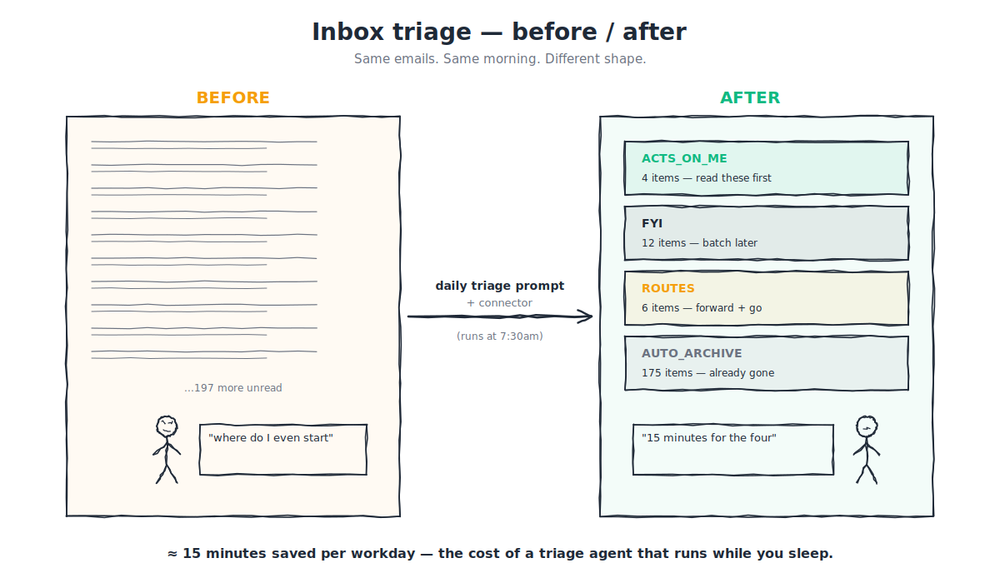

# 0B.3 — Triage automations

> **⏱ 25 minutes · 👥 PMs, designers, ops, anyone with a queue · 🎯 Leaves with:** three concrete triage recipes (for inbox, Slack, and an on-call queue) that you can stand up in an afternoon and a clear sense of *which kind of triage AI is good at and which kind it isn't.*

---

## The thing you're actually trying to fix

Open your inbox right now. Don't act on it. Just look. Some fraction of what you're seeing is real work: a client question that needs your judgement, a colleague waiting on a decision, a calendar invite from your skip. But a large fraction is *noise*: newsletters you forgot you subscribed to, automated alerts you skim and dismiss, FYI threads you got CC'd on, tickets the system thought you might care about.

A typical knowledge worker spends 30–60 minutes a day **just sorting**. Reading enough of each item to decide *does this need me, does this need a quick reply, or does this need to be archived?* The decision is usually obvious within the first three sentences. The cost is in the cumulative re-doing of it across hundreds of items per week.

Triage automation is the part where you teach an AI agent to do the *first pass* of that sorting — not to replace your judgement, but to make sure your judgement only gets spent on the items that actually need it. This is the highest-leverage hour of work in the whole Ops 101 track.

---

## What "triage" means here, precisely

Triage = sorting an incoming queue into buckets *with named follow-up actions per bucket*.

Three buckets cover most cases, although the names will vary by surface:

- **Acts on me.** Needs my attention, probably today. Move to the top.
- **FYI.** I should be aware but no action required. Move to a "read later" pile.
- **Auto-archive.** Trash, newsletter, automated alert that didn't actually do anything. Get it out of my face.

Some queues need a fourth bucket:

- **Routes to someone else.** This isn't actually mine; forward to the right person and stop tracking it.

The discipline of triage is *naming your buckets up front*. An AI agent that has clear bucket definitions will sort consistently. An agent told only "help me triage my inbox" will sort whimsically. The recipes below all start by naming the buckets explicitly.

---

## Recipe 1 — Inbox triage (45-minute setup, ~15 minutes saved per workday)

**The connector you need.** Gmail (or your email tool, via the Workspace connector).

**The shape of the workflow.**

Each morning, before you open your inbox yourself, ask Claude (in Cowork or Claude.ai with the connector active):

> "Pull every unread email I received in the last 24 hours. For each one, classify it into one of: ACTS_ON_ME, FYI, ROUTES_TO_SOMEONE_ELSE, or AUTO_ARCHIVE. Use these definitions:
>
> - **ACTS_ON_ME** = a human is waiting on me to respond, decide, or act. Includes direct asks, calendar conflicts, anything urgent.
> - **FYI** = I should be aware but no action is needed. Includes status updates from teams I'm part of, decision recaps that don't need my input, automated reports I read for context.
> - **ROUTES_TO_SOMEONE_ELSE** = mistakenly sent to me; should go to a specific other person. Tell me who.
> - **AUTO_ARCHIVE** = newsletters, marketing, automated noise, alerts about things I don't care about.
>
> Group the results by bucket. For ACTS_ON_ME, give me a one-line summary of what's needed and from whom. For FYI, just the subjects. For ROUTES, name the right recipient. For AUTO_ARCHIVE, just a count."

The output is your morning briefing. You spend two minutes on it, instead of twenty minutes scrolling.

**The first week** will produce some misclassifications — a thing it called "FYI" that actually needed action, or vice versa. When that happens, *correct it explicitly*: "this one was actually ACTS_ON_ME because [reason]." Within a few days the agent stabilises. Save the final prompt as a recipe. Appendix I — Templates [coming] will hold the reusable recipe format.

**Reliability tip.** Don't let the agent *act* on the inbox the first week — no auto-archives, no auto-routing. It's a *briefing* tool until you trust the buckets. After two weeks of stable behaviour, you can let it auto-archive the AUTO_ARCHIVE pile, but keep ACTS_ON_ME and ROUTES under your eye.

---

## Recipe 2 — Slack triage (30-minute setup, ~30 minutes saved per workday)

This one is a bigger deal than inbox triage for most readers, because Slack is where most of us actually drown.

**The connector you need.** Slack.

**The shape of the workflow.**

Twice a day (say, mid-morning and after lunch) ask Claude:

> "Read every channel I'm in plus my DMs. Show me, in order:
>
> 1. Direct mentions of me that I haven't responded to. For each: who pinged me, in which channel, the gist of what they said, and whether they need an action or just an acknowledgement.
> 2. Threads I'm participating in where someone replied since I last checked. For each: where, what's new, do I need to weigh in?
> 3. Channels where something *significant* happened that I should know about (a decision was made, a customer issue came in, an outage was declared). Just headlines.
> 4. Everything else: ignore."

The output is a 60-second briefing of "what's happened in Slack since last time." If you have an open Slack tab and run this every couple of hours, *you'll never miss a mention again*, and you'll stop doing the thing where you re-read three thousand messages because you're terrified you missed something.

**The crucial step.** Define what "significant" means for *you*. For a PM, it might be "anything in the customer escalation channel, anything tagged as a decision, anything with `[blocker]`." For a designer, it might be "anything in design-review channels, anything mentioning a Figma file I own, anything with a feedback request." Be specific. The Slack triage that's tuned to your role saves five times more time than a generic one.

**Reliability tip.** This one is hard for Claude to get exactly right because "significant" is subjective. Expect to refine the definition of significance for two or three weeks. When you find the version that works, write it down — in your minimum viable wiki (chapter 0B.8) — so it survives.

---

## Recipe 3 — On-call / queue triage (1-hour setup, several hours saved per on-call rotation)

If your role includes being on-call for a queue — support tickets, customer escalations, security alerts, infrastructure pages, design QA backlog — this is the highest-impact recipe in the chapter.

**The connector you need.** Whichever ticketing tool the queue lives in.

**The shape of the workflow.**

When you go on-call (or at the start of each shift), ask Claude:

> "Pull every open ticket in [QUEUE] that's unassigned or assigned to me. For each, classify it as:
>
> - **P0 (now)**: customer-impacting, blocking, or escalation. Show me everything you have on it: full description, related tickets, any prior fix attempts, the customer's tier if visible.
> - **P1 (today)** — needs a fix or response today, but not blocking. Summarise it in two lines.
> - **P2 (this week)** — real bug or request, can wait. One-line summary.
> - **NOISE**: duplicate, already-fixed, malformed, or not actually a ticket. Tell me which.
>
> For each P0 and P1, suggest the most likely owner based on the surface area mentioned. Don't auto-assign — just suggest."

The first time you run this, plan to spend 20 minutes correcting the bucketing. After that, your daily on-call sweep is fifteen minutes instead of two hours.

**The escalation pattern.** For P0s, ask Claude (separately) to also: read related Slack threads, check if a similar ticket was solved before, surface the repro steps if any, flag the customer's history. *The triage step is fast; the context-gathering step makes the actual fix far faster.* This is a two-prompt pattern — first triage, then deep-context the items that earned it.

**Reliability tip.** Never let an automation auto-respond to a P0 ticket. The reliability of triage is high; the reliability of *answering* a real customer issue is variable. Triage frees you up to write the right answer faster, not to skip writing it.

---

## What triage automations are and aren't good at

A short, honest list before you go build.

**Good at:**

- Sorting items into well-defined buckets when the rules can be written in a paragraph.
- Surfacing patterns in a queue ("you've gotten 4 different complaints about the same checkout step in the last 48 hours").
- Summarising the body of an item so you can decide without opening it.
- Pulling context that lives in *other* tools: the related ticket, the prior thread, the linked doc.

**Not good at, yet:**

- Distinguishing tone reliably (a polite frustrated customer can read as a chill request).
- Knowing your team's invisible context (the PM you wouldn't normally route to because they're on PTO).
- Judging political sensitivity (the email from the executive that needs handling carefully).
- Anything where the *consequences of getting it wrong* are large: escalations, legal, compliance, urgent customer issues. For these, AI assists; humans decide.

The right line is: **let AI do the first pass; you do the final call.** That's the contract for everything in the rest of this chapter and most of this track.

---

## Connecting this back to the boss fight

Recipe 1, 2, or 3 is a perfectly defensible boss-fight candidate. If you're triaging your inbox in 2 minutes instead of 20, that's 90 minutes a week back. Run it for two weeks; if it survives, it's a recipe worth contributing to the library.

Two specific suggestions before you commit a triage automation as your boss fight:

- **Pick the queue that *bleeds* the most time.** If your inbox is fine and your Slack is hell, pick Slack. If Slack is fine and on-call ruins your weekends, pick on-call. The biggest time-saver wins.
- **Plan to refine for 2 weeks.** The first week's classifications will be wrong in interesting ways. The second week is when the recipe stabilises. The boss fight measures the *stabilised* week. That's the artefact worth contributing.

---

## A common failure mode (and how to avoid it)

The most common way these recipes go wrong is the same way: **the user defines a bucket too vaguely**, the agent sorts inconsistently, the user gets frustrated, and the automation gets quietly abandoned within a week.

The fix is dull but reliable: *write each bucket's definition as you'd explain it to a new joiner on day one*. Specific. Concrete. With an example item that fits each bucket. The clearer your bucket definitions, the more reliable your agent. This is true of every Claude-driven workflow in the rest of this track, but it's most visible in triage because triage is *just* sorting.

If you find yourself frustrated at a triage automation, before adjusting the prompt, look at the bucket definitions. The fault is almost always there.

---

## What you should carry into the next chapter

- Triage = sorting incoming queues into buckets *with named follow-up actions per bucket*. Define the buckets first.
- Three reusable recipes: inbox, Slack, on-call queue. Each saves serious time once stable.
- AI does the first pass; *you* do the final call. Especially for anything customer-, urgent-, or political-flavoured.
- The first week's classifications will be wrong in instructive ways. Refine for two weeks before measuring.
- The next chapter ([0B.4 — Generation automations](04-generation-automations.md)) flips the direction: instead of *sorting* inputs, you'll be *producing* outputs: standups, meeting notes, weekly summaries.

---

**Previous:** [← 0B.2 The non-coding AI surface](02-non-coding-ai-surface.md) · **Next:** [→ 0B.4 Generation automations](04-generation-automations.md)

**Further reading**
- [Anthropic's Slack connector docs](https://www.anthropic.com/) — official setup for the Slack connector
- [Cal Newport — *A World Without Email*](https://calnewport.com/a-world-without-email-receive-the-first-chapter-free/) — the long-form case for fixing the email-and-chat tax that this chapter operationalises
- [Lenny's Newsletter — 25 proven AI-adoption tactics](https://www.lennysnewsletter.com/p/25-proven-tactics-to-accelerate-ai) — for why "earned hours" is the right adoption wedge
