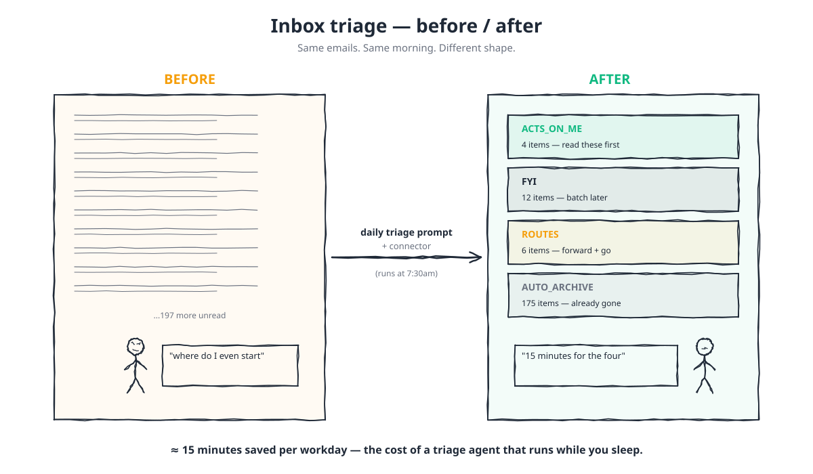

# 0B.3 — Triage automations

> **⏱ 25 minutes · 👥 PMs, designers, ops, anyone with a queue · 🎯 Leaves with:** three concrete triage recipes (for inbox, Slack, and an on-call queue), plus an acceptance card for deciding whether each recipe is trustworthy and worth keeping.



---

## The thing you're actually trying to fix

Open your inbox or work queue. Some items need your judgement: a client question, a colleague waiting on a decision, a broken journey. Others are routine alerts, FYI threads, duplicates, or items that belong elsewhere. The useful automation is not “make the queue disappear.” It is “make the first sorting pass consistent enough that I can review the right items sooner.”

Before automating, measure one representative manual pass: record the queue, time window, item count, time spent, and anything urgent you nearly missed. That is your baseline. Without it, a neat briefing can *feel* faster while quietly omitting work.

Triage automation teaches an AI agent to propose the first pass. Your judgement still owns the final classification and every consequential action.

---

## What "triage" means here, precisely

Triage = sorting an incoming queue into buckets *with named follow-up actions per bucket*.

Three buckets cover most cases, although the names will vary by surface:

- **Acts on me.** Needs my attention, probably today. Move to the top.
- **FYI.** I should be aware but no action required. Move to a "read later" pile.
- **Auto-archive.** Trash, newsletter, automated alert that didn't actually do anything. Get it out of my face.

Some queues need a fourth bucket:

- **Routes to someone else.** This isn't actually mine; forward to the right person and stop tracking it.

The discipline of triage is *naming your buckets up front*. Clear definitions give the agent a testable sorting contract. “Help me triage my inbox” does not. The recipes below all start by naming the buckets explicitly.

Every recipe also needs a **coverage receipt**: which sources it searched, the query and time window, how many items it returned, whether results were truncated, and which requested sources were inaccessible or skipped. “No urgent items” is useful only when you know what the agent actually checked.

---

## Recipe 1 — Inbox triage

**The connector you need.** Gmail (or your email tool, via the Workspace connector).

**The shape of the workflow.**

Each morning, before you open your inbox yourself, ask Claude (in Cowork or Claude.ai with the connector active):

> "Using the connected mailbox sources you can access, pull unread email I received in the last 24 hours. Before classifying, report the mailbox, exact time window, item count, and any requested source you could not search. For each returned item, classify it into one of: ACTS_ON_ME, FYI, ROUTES_TO_SOMEONE_ELSE, or AUTO_ARCHIVE. Use these definitions:
>
> - **ACTS_ON_ME** = a human is waiting on me to respond, decide, or act. Includes direct asks, calendar conflicts, anything urgent.
> - **FYI** = I should be aware but no action is needed. Includes status updates from teams I'm part of, decision recaps that don't need my input, automated reports I read for context.
> - **ROUTES_TO_SOMEONE_ELSE** = mistakenly sent to me; should go to a specific other person. Tell me who.
> - **AUTO_ARCHIVE** = newsletters, marketing, automated noise, alerts about things I don't care about.
>
> Group the results by bucket. For ACTS_ON_ME, give me a one-line summary of what's needed and from whom. For FYI, show the subjects. For ROUTES, suggest the right recipient and why. For AUTO_ARCHIVE, show the subjects during calibration rather than only a count. Cite or link every item. Do not archive, forward, reply, or change state."

The output is a proposed morning briefing. Compare it with the mailbox before trusting it: open every ACTS_ON_ME item, inspect every proposed AUTO_ARCHIVE item, and look for at least one known message from the window. Log omissions and wrong buckets.

When you find a misclassification — a thing it called "FYI" that actually needed action, or vice versa — correct the bucket definition, not just that one output: "this was ACTS_ON_ME because [reason]. Add that rule and show me where it applies." Save the prompt as a recipe only after it handles a representative set. [Appendix I — Templates](../../appendices/I-templates/README.md) holds the reusable recipe format.

**Reliability tip.** Keep this in briefing mode while you calibrate: no auto-archives, forwarding, routing, or replies. Promote only a narrow, reversible action after your sample shows no missed action items, the false-positive rate is acceptable to you, and missing coverage fails loudly. Keep ACTS_ON_ME and ROUTES under human review.

---

## Recipe 2 — Slack triage

Slack triage has a wider and less predictable source set than one mailbox, so coverage matters as much as classification.

**The connector you need.** Slack.

**The shape of the workflow.**

At a cadence that matches your role, ask Claude:

> "Search [REQUIRED_CHANNELS_OR_CONVERSATION_TYPES] through the connected Slack source for activity since [LAST_CHECKED_AT]. First report the exact time window, conversations searched, returned item count, whether results were truncated, and any requested channel or conversation you could not access. Then show me, in order:
>
> 1. Direct mentions of me that I haven't responded to. For each: who pinged me, in which channel, the gist of what they said, and whether they need an action or just an acknowledgement.
> 2. Threads I'm participating in where someone replied since I last checked. For each: where, what's new, do I need to weigh in?
> 3. Channels where something *significant* happened that I should know about (a decision was made, a customer issue came in, an outage was declared). Just headlines.
> 4. Everything else: ignore.
>
> Link every reported message or thread. Do not post, react, or mark anything read."

Treat the output as an index, not proof that nothing else happened. During calibration, open a known mention and a thread you participated in, then confirm both appear. If a source is missing or a link cannot be opened, use Slack directly for that part of the window.

**The crucial step.** Define what "significant" means for *you*. For a PM, it might be "anything in the customer escalation channel, anything tagged as a decision, anything with `[blocker]`." For a designer, it might be "anything in design-review channels, anything mentioning a Figma file I own, anything with a feedback request." Be specific, then test those rules against real examples from your baseline.

**Reliability tip.** "Significant" is subjective, and connector access can change. Re-check both classification and coverage until your representative sample is clean, then write the working definition down in your minimum viable wiki (chapter 0B.8). Keep a direct-Slack fallback for omitted sources.

---

## Recipe 3 — On-call / queue triage

If your role includes being on-call for a queue — support tickets, customer escalations, security alerts, infrastructure pages, or a design QA backlog — this recipe can shorten the first sorting pass while keeping priority and response decisions human-owned.

**The connector you need.** Whichever ticketing tool the queue lives in.

**The shape of the workflow.**

When you go on-call (or at the start of each shift), ask Claude:

> "Using the connected ticket source, pull every open ticket in [QUEUE] that's unassigned or assigned to me. First report the queue, query or filters, retrieval time, returned item count, total count if available, pagination or truncation state, and any source or field you could not access. Use the queue's documented priority policy; if these labels conflict with it, stop and ask me to map them. For each returned item, classify it as:
>
> - **P0 (now)**: customer-impacting, blocking, or escalation. Show me everything you have on it: full description, related tickets, any prior fix attempts, the customer's tier if visible.
> - **P1 (today)** — needs a fix or response today, but not blocking. Summarise it in two lines.
> - **P2 (this week)** — real bug or request, can wait. One-line summary.
> - **NOISE**: duplicate, already-fixed, malformed, or not actually a ticket. Tell me which.
>
> For each P0 and P1, suggest the most likely owner based on the surface area mentioned and cite the ownership source. If the source is absent or stale, say OWNER_UNKNOWN. Don't change priority, auto-assign, reply, or close anything."

Review every proposed P0 and P1, a sample from each lower bucket, every OWNER_UNKNOWN item, and the queue's unclassified remainder. Compare elapsed time and errors with your baseline; the result, not the recipe heading, tells you whether the workflow saved time.

**The escalation pattern.** For P0s, ask Claude (separately) to also: read related Slack threads, check if a similar ticket was solved before, surface the repro steps if any, flag the customer's history. *The triage step is fast; the context-gathering step makes the actual fix far faster.* This is a two-prompt pattern — first triage, then deep-context the items that earned it.

**Reliability tip.** Never let an automation auto-respond to a P0 ticket. A sorting proposal and a customer-facing answer have different evidence and consequence. Triage should help you reach the right item sooner, not skip the human response.

---

## Triage acceptance card

Run the recipe across representative busy and quiet windows before keeping it. Copy this card into your notes for each recipe:

```text
TRIAGE ACCEPTANCE
Queue + owner:
Baseline window / items / minutes:
Requested sources + time window:
Coverage receipt (searched / inaccessible / skipped / truncated):
Review sample (all urgent + all proposed state changes + lower-bucket sample):
False negatives (items needing action that were missed):
False positives / wrong routes:
Human-only actions:
Measured result (items / minutes / errors):
Decision: REFINE / KEEP_AS_BRIEFING / PROMOTE_NARROW_ACTION / STOP
Next review date + kill-switch owner:
```

Stop if the agent cannot report coverage, cite each surfaced item, or preserve a human gate for consequential actions. Refine when the source set is complete but the buckets are weak. Keep it as a briefing when the summary helps but actions are not trustworthy. Promote only the smallest reversible action that your evidence supports.

---

## What triage automations are and aren't good at

A short, honest list before you go build.

**Good at:**

- Sorting items into well-defined buckets when the rules can be written in a paragraph.
- Surfacing patterns in a queue ("you've gotten 4 different complaints about the same checkout step in the last 48 hours").
- Summarising the body of an item so you can decide without opening it.
- Pulling context that lives in connected tools when the source is accessible: the related ticket, prior thread, or linked doc.

**Not good at:**

- Distinguishing tone reliably (a polite frustrated customer can read as a chill request).
- Knowing your team's invisible context (the PM you wouldn't normally route to because they're on PTO).
- Judging political sensitivity (the email from the executive that needs handling carefully).
- Anything where the *consequences of getting it wrong* are large: escalations, legal, compliance, urgent customer issues. For these, AI assists; humans decide.

The right line is: **let AI do the first pass; you do the final call.** That's the contract for everything in the rest of this chapter and most of this track.

---

## Connecting this back to the boss fight

Recipe 1, 2, or 3 is a defensible boss-fight candidate when your baseline and acceptance cards show a real improvement without missed urgent work. Run it across representative busy and quiet windows; if the result survives, it is a recipe worth contributing to the library.

Two specific suggestions before you commit a triage automation as your boss fight:

- **Pick the queue that *bleeds* the most time.** If your inbox is fine and your Slack is hell, pick Slack. If Slack is fine and on-call ruins your weekends, pick on-call. The biggest time-saver wins.
- **Plan to refine before measuring the win.** Use the acceptance card to separate calibration runs from the representative window you report. Contribute the measured result and remaining failure modes, not a best-case demo.

---

## A common failure mode (and how to avoid it)

The most common failures come from **a vague bucket or an incomplete source set**. The agent sorts inconsistently or misses part of the queue, the user loses trust, and the automation gets abandoned.

The fix is dull but reliable: write each bucket's definition as you'd explain it to a new joiner, include one fitting and one borderline example, and require a coverage receipt on every run. Clear buckets improve classification; explicit coverage tells you whether there was anything to classify.

If you are frustrated with a triage automation, inspect the receipt first. Missing source? Fix access or narrow the promise. Complete source set but wrong sorting? Fix the bucket definition. Unknown cause? Keep it in briefing mode.

---

## What you should carry into the next chapter

- Triage = sorting incoming queues into buckets *with named follow-up actions per bucket*. Define the buckets first.
- Three reusable recipes: inbox, Slack, on-call queue. Measure each against its own baseline.
- AI does the first pass; *you* do the final call. Especially for anything customer-, urgent-, or political-flavoured.
- Coverage is part of correctness. Require sources, time window, item count, gaps, and links.
- Use the acceptance card to decide whether to refine, keep briefing-only, promote one narrow action, or stop.
- The next chapter ([0B.4 — Generation automations](04-generation-automations.md)) flips the direction: instead of *sorting* inputs, you'll be *producing* outputs: standups, meeting notes, weekly summaries.

---

**Previous:** [← 0B.2 The non-coding AI surface](02-non-coding-ai-surface.md) · **Next:** [→ 0B.4 Generation automations](04-generation-automations.md)

**Further reading**
- [Anthropic's Slack connector docs](https://www.anthropic.com/) — official setup for the Slack connector
- [Cal Newport — *A World Without Email*](https://calnewport.com/a-world-without-email-receive-the-first-chapter-free/) — the long-form case for fixing the email-and-chat tax that this chapter operationalises
- [Lenny's Newsletter — 25 proven AI-adoption tactics](https://www.lennysnewsletter.com/p/25-proven-tactics-to-accelerate-ai) — for why "earned hours" is the right adoption wedge
