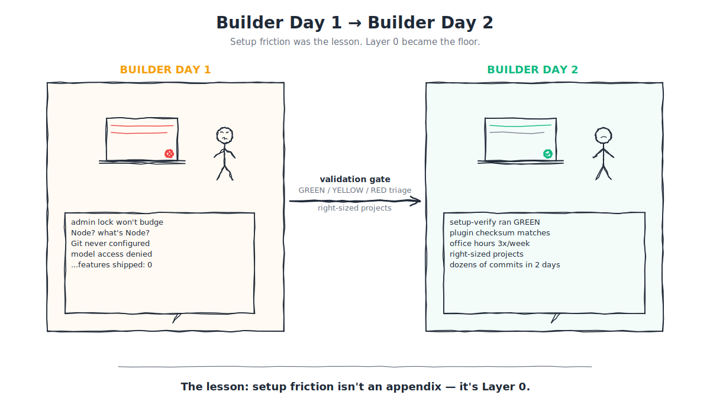

# 0.2 — The origin story (and why setup is Layer 0)

> **⏱ 8 minutes · 👥 Everyone · 🎯 Leaves with:** a gut-level understanding of why every belt in this playbook treats environment setup as the first boss fight, not a footnote.

---

## If you're short on time

1. Our **first Builder Day** put dozens of people in a room with Claude Code, an open repo, and a full day on the clock. The cohort shipped **zero features**. The overwhelming majority of the day went to fighting laptop restrictions, missing admin passwords, and broken package installs.
2. Our **second Builder Day** ran the same format *after* three weeks of structured prep, a mandatory setup gate, and a colour-coded triage tracker. Non-engineers pushed **dozens of commits** across two days. Multiple pull requests landed in production-adjacent repos same-week.
3. The difference wasn't talent, luck, or a better model. The difference was treating **setup as Layer 0** — a first-class belt requirement, not "hygiene you'll figure out on the morning." This entire playbook is built around that lesson.

---

## The scene: the first Builder Day

The pitch was clean. We had been hearing for months that AI coding tools were collapsing the time from idea to shipped UI. Frontend capacity was the bottleneck for every POD. If designers and PMs could land even small changes themselves, the whole product org would de-throttle.

So we did the obvious thing: booked a room, picked a day, invited a cohort of curious non-engineers with laptops, and told them "today we build." No prep. No validation. No backup plan. "Show up and we'll figure it out" was, in retrospect, the most expensive sentence of the quarter.

The post-mortem's summary is uncomfortable reading. Roughly:

| Where the day went | Share |
|---|---|
| Setup debugging — installing Claude Code, chasing repo access, fighting Git config, asking IT for admin rights they did not have | **vast majority** |
| Actual building — prompting Claude, previewing UI, opening PRs | **a sliver** |
| Everything else — lunch, context-switching, watching a neighbour unstuck themselves | **what remained** |

Features shipped to staging or production: **zero.** The one-line takeaway, burned into the top of the retro: *"People need working setups BEFORE event day. No exceptions."*

This is Layer 0. The layer underneath the layers. The stuff nobody thinks to write down because it's embarrassing how much it matters. Your entire event could have the best models in the world, the best documentation in the world, the best mentors in the world: and it would still fail, because a laptop with MDM restrictions and no admin password cannot run `brew install node`, and everything else is downstream of that.

---

## Why it failed — the honest diagnosis

Four root causes, each of which this playbook now has a countermeasure for. Read them carefully; if you recognise any of them in your own current setup, the Prologue is doing its job.

**1. Laptop restrictions were invisible until event day.** Razorpay-issued machines ship with MDM policies that block most unsigned installers. Nobody had run through the install in advance, so nobody knew which steps would prompt for admin rights they didn't have. The *first* time many attendees discovered this was in a packed room with dozens of other people hitting the same wall.

**2. "15-minute setup" was fiction.** The setup guide, such as it was, assumed a clean Mac with Homebrew and Node already installed. A realistic end-to-end run — fresh laptop, institutional repo access, Node/pnpm/nvm, Claude Code auth, repo clone, package install, dev server up — is **30–60 minutes if everything works**, and unknowable if anything doesn't. The event budgeted 15 minutes.

**3. The mentor-to-attendee ratio was wrong.** Roughly one mentor per ten attendees, when the mentors were being asked to triage install errors one by one. It turned into a queue, and queues in a time-boxed event are lethal — they don't clear, they just move the ceiling down.

**4. There was no "plan B" for blocked people.** If your laptop couldn't run the tools, the event had nothing else to offer you. You sat there. You watched. You left early. No cloud IDE fallback. No pairing lane. No loaner machines. "Blocked" was a dead-end state, not a branch in the flow.

Those four failures, stacked, produced the day's setup-versus-building ratio.

---

## The rebuild — what changed in three weeks

The strategy for the second Builder Day fit on a single line: *frontload all setup friction into structured pre-event touchpoints over three weeks.* Every tactic below is a consequence of that one decision.

**A pre-event validation gate.** Four things had to be green before you were allowed into the room: Claude Code installed and authed, repo cloned and a test commit pushed to a personal branch, the package install completing cleanly with the dev server up, and the Week 3 pre-work tutorial done. Miss the gate by the week-two deadline, get flagged YELLOW. Miss the rescue window, get moved to a contingency lane.

**A GREEN / YELLOW / RED triage spreadsheet.** Every registered attendee was a row. Every row was a colour. GREEN meant ship-ready, YELLOW meant partial (specific blocker named), RED meant hardware-blocked (MDM, admin access, genuinely incompatible OS). The colour wasn't a judgement — it was a routing decision. GREEN went straight to projects. YELLOW got 1:1 office-hours time. RED got paired with a GREEN teammate, or assigned to a cloud IDE, or handed a loaner laptop. No one stayed blocked passively.

**A frozen plugin build.** The Razorpay plugin for Claude Code (which ships skills, hooks, agents, slash-commands, and MCP configs) was evolving week to week. Great for the program overall, terrible for an event three weeks out. We froze a version, checksummed it, distributed from a single pinned link — and a tiny verification script confirmed that *your* version matched *the* version before you walked in. [Appendix B](../appendices/B-environment-setup/README.md) now holds the durable setup rationale.

**Three office hours, not one.** Spaced roughly a week apart. First pass was "does the installer run." Second pass was "why is your Node version weird." Third pass was "your pre-work doesn't work — let's pair." Each session targeted a different failure mode discovered in the previous week's tracking data. The office hours were how the triage spreadsheet turned from a red sea into a green one.

**Mentor ratio cut to ~1:3.** Pre-assigned to groups. No more "who do I ask?" confusion. Mentors had a named group to be responsible for, and the group had a named mentor to escalate to. This is an almost boring change, but it's the one that moved the event-day time budget from "mostly queueing" to "mostly building."

**Right-sized projects.** All event-day projects were mentor-pre-tested against a 4–6 hour scope, frontend-heavy, non-critical so quality variance was tolerable. Examples: internal dashboard UI refresh, settings page redesign, a reporting view over existing data, a feature-flag management interface. Boring? On purpose. We didn't need moonshots to prove the thesis — we needed PRs.

---

## What the second event produced

Two days on-site. A very different room from the first.

- **Attendance held.** Most registrations showed up (vs. the "people quietly don't come because they couldn't install it" pattern from the first event).
- **Commits shipped:** **dozens of code commits** across the cohort over two days — from *non-engineers*. Designers, PMs, ops folks, TPMs.
- **PRs opened:** more than half of attendees raised at least one PR in a Razorpay org repo. Several were merged same-week after FE review.
- **Feature domain:** internal dashboards, settings flows, analytics views, small Blade component tweaks — exactly the catalogue the belt system anticipates.
- **Cohort interest:** more than half of event-day attendees expressed interest in enrolling in the structured Ship-to-Learn track (the template for Appendix M of this playbook).

And crucially — the **event-day setup time was effectively zero.** People walked in, opened their laptops, ran one verification script, saw green, and started prompting Claude. The setup-heavy ratio from the first event became closer to zero at the second. That gap is the delta this playbook is trying to reproduce.

Before the second event even happened, the first *certified* builder had already shipped AI-generated code to production — through the same prep pipeline that became the second Builder Day. A structured setup, version-locked tooling, a design-system-aware plugin. Not a moonshot; a proof of concept for the rest of us. [Appendix L — Certification](../appendices/L-certification/README.md) holds the belt-to-program contract.

---

## The lesson, generalised

The single most important idea in this playbook is that **setup is not hygiene; setup is the first boss fight.** Every belt has a Layer 0 gate built into it for this reason.

- **White Belt Quest W-0: "Turn GREEN":** you run a verification skill, show an all-green checklist, and only then are you allowed to attempt the W-1 quest. Same contract as the second Builder Day's validation checklist. Same reason.
- **Yellow Belt assumes GREEN:** if you're stuck on install at Yellow, you're actually at White. The playbook will send you back one level — not as a punishment, but because the cost of pushing forward with a broken environment is wildly non-linear.
- **Green and Black Belts assume Layer 0 is muscle memory:** you don't remember where your MCPs live, you just know they live somewhere and they work. When they break, you know the three places to look.

We borrowed this framing from Ramp's L0–L3 proficiency framework and from [Lenny Rachitsky's write-up of 25 proven AI-adoption tactics](https://www.lennysnewsletter.com/p/25-proven-tactics-to-accelerate-ai) — but the Razorpay-shaped lesson came from our own floor, at our own first event. That is why the belts are named in the spirit of that arc: you earn White by surviving the install. You earn Yellow by shipping something after the install works. You earn Green by making the install work for *other people.* You earn Black by making the install irrelevant.

---

## The three-line version, for forwarding

If you're sending this playbook to someone on your team and want a one-paragraph pitch:

> *"Razorpay ran a Builder Day where non-engineers with working laptops and good intentions shipped zero features because the majority of the day went to setup friction. Three weeks of structured prep — a pre-event gate, a GREEN/YELLOW/RED tracker, a frozen plugin build, three office hours, and right-sized projects — turned the same format into dozens of commits across two days. This playbook is the program that produced that delta, formalised into belts you can earn regardless of your starting point."*

That's the story. That's why setup is Layer 0. That's why the Prologue exists before the White Belt. And that's why the next chapter ([0.3 — The 5-Layer Mental Model](03-mental-model.md)) teaches you the five-layer stack that Layer 0 sits underneath — because once you can see the shape of the stack, you can see why each piece exists.

---

## What you should carry into the next chapter

Four things, in descending order of importance:

- **Setup failure is a design failure, not a user failure.** If someone on your team is stuck, the playbook is underspecified; they are not underprepared.
- **Version-lock your tooling before any structured event.** Frozen plugin builds + checksum verification + a single distribution link is a non-negotiable pattern. See Appendix B.
- **Triage colour-codes beat ad-hoc help.** GREEN / YELLOW / RED is a lightweight contract that works for cohorts from 5 to 500.
- **"Shipping" only counts if setup doesn't count.** A PR that took two hours to open because your environment worked is infinitely more valuable than a "feature" that took a day because the environment didn't.

---

**Previous:** [← 0.1 Welcome, and why this playbook exists](01-welcome.md) · **Next:** [→ 0.3 The 5-Layer Mental Model](03-mental-model.md)

**Further reading**
- [Lenny's Newsletter — 25 proven AI-adoption tactics](https://www.lennysnewsletter.com/p/25-proven-tactics-to-accelerate-ai) — the patterns behind champions, visible wins, and cohort-based rollout
- [Simon Willison — designing agentic loops](https://simonwillison.net/2025/Oct/15/designing-agentic-loops/) — prompt × context × harness, the frame the later belts use
- [Ramp's L0–L3 proficiency model](https://ramp.com/blog/how-ramp-measures-ai-adoption) — the structural ancestor of the belt system
- [Anthropic's Claude Code best-practices](https://code.claude.com/docs/en/best-practices)
